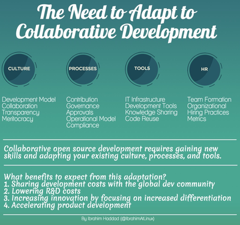
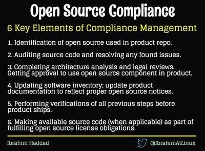
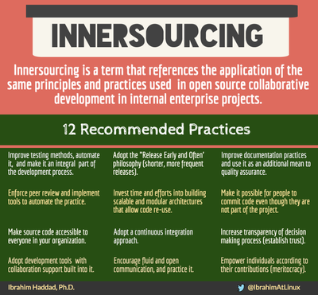
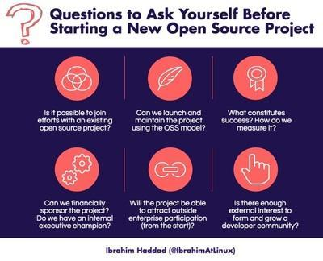
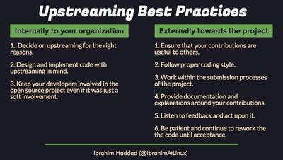

# Building Leadership in an Open Source Community

Integrating into open source communities takes time and effort and requires a new approach to product development. Where traditional, proprietary development requires secrecy and a management hierarchy, open source development requires openness and values consensus. Code contributions, not title or position, are what determine influence and technical direction in an open source project.

Open source projects are developed in diverse and geographically dispersed communities that have their own rules, conventions, tools, and processes. Simply put, each community has its own unique culture and it takes time to establish the trust, ways of collaborating, and cultural understanding required to be effective in open source.

This guide explains how organizations can build leadership and influence within the open source projects they’re involved in and on which they are commercially dependent. Learn about leadership culture and roles within a project, how decisions are made, how an organization can build leadership, and tips for being a good leader in open source communities.

## Why build leadership in an open source project

Although the open source culture is collaborative, contributing upstream is only the first step in shaping an open source project’s progression. Taking an active role in guiding or influencing the project’s direction is also important if the project is critical to your company’s own products.

While open source projects have repeatedly proved the value of collaborations that even -- and maybe especially – include competitors, having no say in a project’s direction can quickly prove to be a competitive disadvantage. And this is why building and maintaining leadership in open source projects is key to corporate strategies and goals. However, it isn’t as easy as pounding desks and throwing around cash-based clout.

## Leadership culture in open source

It is common for companies to first assume that leadership in an open source community works the same way as leadership does in a corporation. It doesn’t.

> "Companies often go through a phase of thinking "Oh, well, we're huge. Why can't we pound our fist on the table and just make the community do what we want?" explains Guy Martin, Director of the Open@ADSK initiative at Autodesk.

> "They soon come to realize that tactic won’t work. They come to understand that the only way to gain leadership is to earn the role within the community. And the only way to do that is to gain credibility and make contributions."

## Corporate vs open source leadership

While gaining leadership in an open source project can be vital to a company’s own success in the commercial world, taking on such a radically new approach to product development is often counterintuitive and sometimes awkward in the beginning. 

Traditional, proprietary development requires secrecy and a management hierarchy. By contrast, titles and positions are meaningless in open source development, which instead puts a premium on openness and consensus.

Code contributions are what determine influence and technical direction in an open source project. That means no fudging on code contributions; they must be substantial and truly advance the project in some way.

At first, making upstream contributions and openly collaborating can feel like giving away the store. But that feeling is not based in the open source reality; instead, it is a twinge of apprehension commonly associated with making a significant change in thinking and actions that is so very necessary to innovating.

The open source leadership mindset involves thinking about:

* Influence, not control
* Transparency as a means of crowd-sourcing solutions, not as exposure 
* Leading, not herding

Successfully making the shift from a proprietary to an open source mindset and culture requires time and effort and sometimes a regular reminder of the benefits in doing so. [Ibrahim Haddad](https://www.linkedin.com/in/ibrahimhaddad/), vice president of R&D and Head of Open Source at Samsung Electronics, built this chart for ease of reference. 

## Governance overview

Governance guidelines in open source communities tend to be few but they are nonetheless rigidly enforced. The code of conduct or community guidelines are unique to the community but generally address acceptable and expected behavior and the procedures for handling unacceptable behavior or other incidents. A governance policy details the management of the open source project’s policies, structures and roadmap. A maintenance policy typically addresses other project decisions such as software updates. 

But governance at and surrounding the project and community level does not represent the entirety of governance policies and issues. Those also exist at the points where open source software (OSS) is consumed, contributed to, redistributed and/or produced by commercial interests or other organizations. Therefore, open source governance is by necessity part of the broader IT governance effort. 

Companies tend to experience similar issues, such as multiple processes for how open source is consumed, inconsistent ways of contributing upstream in communities, and variances in how open source projects are created internally. Developing a standardized set of governance is key to taming the chaos. 

> "We aimed for one single process for contributing upstream and as an engineer I wanted it streamlined," Martin said.  “I didn't want a ten-week process with 500 pages of documentation for a five-line bug fix, so I worked with legal to streamline the workflow so an engineer could accomplish it in a reasonable amount of time. And then we did the same thing for creation of opensource projects from code that's in the company.”

It’s best for each company to work out the particulars in its own open source governance policies and processes so that it best fits how their company actually works; in effect mirroring how governance is best done at the community level. But be aware that you may not be able to repeat a single process for all open source activities in your company.

A consistent governance plan prevents a huge version skew, as well as open source license and security issues. "A consistent governance model for open source consumption helps ensure compliance so that when we ship something, we know we've got the right license compliance in place."

## Culture overview

While there is a pressing need to shift an organization’s internal culture to an open source state of mind, such must be accomplished without losing sight of, or disconnecting from, the open source community outside of the company walls. 

> "In order to develop influence on an open source project, you have to get a group of people whom you don't know, who work for different companies, and may have different objectives to agree with you," explains [Gil Yehuda](https://www.linkedin.com/in/gilyehuda/), senior director of open source at Oath (Yahoo+AOL).

That’s often easier said than done, since disputes and pushbacks are common and resolutions can take one of many directions depending on community consensus.

> "In an open source community, you have people who work for different companies who may have lots of areas of shared purpose and shared outcome and some areas of contention and cross purposes," explains Yehuda.

For example, there may be one set of developers who want new functionality because they need it to make something work, but another group that doesn't want that new functionality because they want stability.

> "Perhaps the new functionality compromises the stability or the scalability. There's going to be a fight or at least some tension over that," explains Yehuda.

Resolving the issue so that the project proceeds in one direction or the other is no small feat considering that no one person is in charge of making the decision. Instead, it’s a communal decision.

> "One of the things that can help the community arrive at what you would consider favorable resolution is if you have more influence in the project," says Yehuda. “They're going to support you even in a decision that might have small short term negative impact to them if you have leadership and you're a trusted member of the community, and you have the community's interest at heart.”

But building that leadership and maintaining it is as much a company mission as it is an individual developer’s goal.

Oath’s approach is to instruct its developers to involve company assistance when they see situations that could potentially be contentious. 

> "We have active consulting, we have internal conversations about situations and how to best approach them, we have developers that share anecdotes with each other about situations and how they can resolve them," says Yehuda.

It’s also important to understand that leadership rests with the person, not the company. So even though the individual developer has the backing and assistance of his or her employer, that employer is at risk of losing influence if that developer chooses to leave.

> "If you've got an open source project that is super critical to your product and you've only got one person from your company making upstream contributions, you have a single point of failure," explained Martin. “You have to a succession plan in place and it needs to include more than couple of people at your company.”

That means multiple people in your company will be making upstream contributions. A common first reaction to that idea is fear of tying up too many human resources on an open source project that other companies will benefit from. But that’s not the case if you organize their time well.

> "It’s more palatable to engineering management when less of Joe Smith's time is used to make upstream contributions because that burden is shared with three or four other developers," Says Martin. 

By balancing the workload, you also reduce the risk to the company in losing project influence when a key developer leaves. This is also an attractive plan to developers who actively seek to increase their exposure in building leadership in the community as that ultimately boosts their careers and earning power. More developers get a lead role in this plan. 

Further, a company can adopt open source practices and principles internally through innersourcing, in order to complete the culture shift to open source, improve their innovation rate and successes, and further connect with the open source community which helps build leadership and attract developers. 

 

In short, culture is imperative in all its many nuances and on many levels, if the goal is to build and maintain leadership and thus some measure of control over critical projects.

Through it all, remember to be mindful of the one percent rule. "90% are along for the ride and participate passively - this is the user community; 9% participate actively, submitting bugs, answering questions publicly - we call these "contributors"; 1% help to guide or control the project, assign bugs, determine direction - these are "maintainers", or more simply, leaders," explains Jeff Osier-Mixon, Intel/ Yocto Project.

Each project is unique; adapt on a project by project basis.

## Leadership roles in a collaborative project

While roles appear similar to corporate roles and structure, every project is different and structured and managed by a specific set of community guidelines and a governance policy. Be sure to read the documentation, join IRC for real-time, private chats, join mailing lists, etc. for guidance on how roles are defined and how the project is structured and managed. 

Meanwhile, the following will give you a general understanding of some of the common types of leadership roles.

### Technical leadership

* Committer/ Maintainer
* TAB/ TSC member
* TSC chair/ chief architect
* Documentation/ technical writer - "this is a special case maintainer"

### Governance leadership

* Executive director
* Committees/subcommittees
* Board member/ member representatives

### Operational leadership

* Project managers
* Community managers and advocates

## Leadership roles matrix

Keep in mind that while these roles resemble their traditional counterparts in a historical management hierarchy, they are not the same. One cannot simply transpose the values, processes and principles from the old closed model to the new open source model. In many ways they are direct opposites, or perhaps mirror images. In any case, they are different in every important way. To choose one is to reject the other.

The leaders in open source are comfortable and even promote transparency and must obtain consensus before a project can move ahead.  The process and leadership style can be maddening to those who prefer to cling to the traditional business structure.

In response to the frustrations often encountered in this sweeping cultural change, "a lot of companies will take the path of least resistance, which is "oh this is great. I'm going to start with this as a base, fork it and do my own thing internally," says Martin.

> "The problem is that's not sustainable and scalable in the long term because the further you diverge away from the rest of the community, the harder it's going to be when there's a next major upgrade that you want to pull from the community," he said.

Simply put, open source is a community effort and anything you do that pulls your work away from the community will eventually be to your company’s detriment. 

## How to become a leader

Becoming a leader in a collaborative environment requires considerable people skills and a willingness to see no work as beneath your rank. 

> "It is as simple as noticing that something needs to be done, and doing it -- filing a bug, answering a question, offering to sit in the booth at a conference." - Jeff Osier-Mixon, Open Source Community Manager at Intel, speaking at Open Source Leadership Summit 2017.

And, of course, it requires significant technical skills in open source and the audacity in boldly using them – but only after you’ve studied the lay of the land, understood the group dynamics, and done some of the dirty work yourself.

In other words, becoming a leader starts with earning the group’s respect. You can’t demand it, you must earn it.

### Where to join in to prove your chops and earn leadership

Projects document how to join a committee, become a maintainer, and how to do join in at almost any level. Look at those documents to find a place to begin fitting into the group. You can start anywhere you like, just don’t cut in line.

> "The one thing a person can do to develop influence is listen, understand, really try to read a situation before jumping in. If you can develop that habit over time then I think people will respect your contributions and find you to be more influential," says Yehuda.

Open source conferences also provide a great way to meet other developers and leadership in a community. Beyond networking, making presentations at such events is a noteworthy way to share your and your company’s accomplishments and contributions to open source projects.

Yehuda says his company, Oath, helps developers hone their presentation skills and polish specific presentations so that they succeed on stage. Practice makes perfect, so the more presentations developers make, the better they get at doing it – and the more recognizable their face, name and work becomes to the open source community.

Contributions upstream will do the most in establishing your credentials and reputation in the community, however. Jump in and fix bugs where you see them and make contributions that will be helpful to the entire community and not just for your own projects.

### Joining vs creating a project

Joining a project may seem like a slow path to a leadership position. Indeed, it does take time. However, it has advantages too, including immediate gains by benefitting from the work the community has already done and none of the expense of starting your own project. 

Starting your own projects in order to establish leadership, won’t gain you much.

As Martin put it, "if you're the only group of kids in the sandbox, all from the same company, are you really leaders, or are you just the only people working on the project?"

If you do start a project, do so for reasons other than establishing leadership because frankly no one else might join. That’s especially true if your project is less than stellar or competes with an established project.

"Starting a project takes a lot of work. Don't start it if your code would be better off served contributing to another project where you could become a leader in that project by the basis of your code contributions," advises Martin.

### Technical contributions

Donating code is serious business in open source communities. Building the project is exactly the point of the joint exercise. With many hands, the work is lighter, and by many contributions the risks are lowered and the quality heightened. Those are the goals anyway. 

The number one rule is to make sure that your contributions are useful to others and not just self-serving. But usefulness isn’t limited to big advancements; smaller bug fixes and other tweaks are appreciated too. The point is to make your contribution universally helpful, whether big or small.

Ibrahim Haddad also counsels contributors to follow the proper coding style, work within the project’s submission processes, provide documentation and explanations, listen to feedback, and wait patiently for acceptance. 

### Hiring talent

It’s no secret that open source developers are in short supply. That is likely to remain the case for the foreseeable future given that adoption of open source projects is at an all-time high and shows no signs of slowing. Not only does this mean that it is hard to find skilled developers to hire, but it is also tough to retain them if you do. 

A 2016 Cloud Foundry [report](https://www.cloudfoundry.org/developer-gap-2016/) found that there are "a quarter-million job openings for software developers in the U.S. alone and half a million unfilled jobs that require tech skills."  Additionally, the analysts forecast that the number of unfillable developer jobs will “grow to one million within the next decade.” 

The demand for open source developers is even more extreme. 

Still you can find out who are the leaders and who are regular and skilled contributors in an open source community and try to hire them directly. Or, you can ask them to recommend developers they themselves would like to work with.

> "If you're planning on hiring a maintainer, or hiring a strong contributor, keep in mind that those people are in high demand and they're the most job flexible people on the planet. Meaning, they can go from company to company, and still work on the same project. The only thing that changes is the name of the company signing their paycheck," says Martin.

You can find additional guidance on hiring open source developers in the Linux Guide "[Recruiting Open Source Developers](https://www.linuxfoundation.org/recruiting-open-source-developers/)."

### Building talent (the best way)

Fortunately, open source is so hotly in demand that developers actively seek opportunities to develop or hone their open source chops. Martin says that every developer he’s interviewed to date has asked him how the company will help him build his own open source brand. Helping the developer grow into leadership in an open source community is a prime perk and useful in recruitment.

Raising your own company’s visibility in its open source work can thus also help recruit developers. Some companies even offer open source training to add to the appeal. Presenting the company’s open source projects at conferences and contributing code in communities hare the best ways to raise your company’s visibility. Asking your developers to network with other developers and invite them aboard also tends to work well.

Another key approach to attracting developers is by offering apprenticeships. Developers like to work on significant projects with plenty of reputation-building challenges. Offering apprenticeships and mentorship programs tends to be a successful draw and a great way to leverage the talent you already have onboard.

Above all, gain the community’s trust so that your company is attractive to open source developers and to developers who seek to advance their career by working with a trustworthy, open source leader.

> "Like anyone else, commercially-motivated developers gain influence in the project through the quality and quantity of their contributions." -- [Open Source Guides](https://opensource.guide/leadership-and-governance/#what-happens-if-corporate-employees-start-submitting-contributions), GitHub, Leadership and Governance, corporate employees.

### Strategic contributions

Strategic contributions are significant in establishing leadership. They tend to address a large problem shared across the ecosystem, or provide a key advancement that pushes the project past a community set goal line.

However, you can’t just release the code and forget about it. There’s work to do in providing documentation, expanding the ecosystem, partnering to advance this code or toolset even further, and so on. Staying in the game and remaining both visible and reliable is key.

### Non-technical contributions and support**

Beyond technical contributions, strategic and otherwise, are other ways to contribute and support the community thereby further building leadership.

Those include contributing to and supporting developer education and providing mentorship. Providing support for the technical aspects is another successful way to establish leadership.

The key is to look around and see what the community needs beyond technical contributions and then step up to contribute some of that.

## Final words

In summary, being a good leader and winning influence takes time and hard work.

Specific ways to work at becoming a leader include:

* Adapt to the OSS project culture, practices and tools. Work to fit in and follow the rules and processes. Remember it’s not about you; it’s about the project.
* Do the grunt work. Projects need workhorses, not all-stars. Besides, if you can’t do the work, you can’t earn the right to lead. Be quick to show you can and will do the work needed.
* Be magnanimous. Contribute code that benefits the whole project.
* Build consensus. True leaders can build consensus, work to help achieve consensus even before becoming a leader to show that you aren’t a grandstander or a tyrant. 
* Accept that leadership changes. Recognize and accept that leadership roles move with the people, not the company that employs them. 

## Acknowledgements

Contributors to this guide:

* Guy Martin, Autodesk
* Gil Yehuda, Oath

*These resources were created in partnership with the TODO Group: the professional open source program networking group at The Linux Foundation. A special thank you to Pam Baker for writing assistance and the open source program managers who contributed their time and knowledge to making these comprehensive guides. Participating companies include Autodesk, Comcast, Dropbox, Facebook, Google, Intel, Microsoft, Netflix, Oath (Yahoo + AOL), Red Hat, Salesforce, Samsung and VMware. To learn more, visit: [todogroup.org](http://todogroup.org/)*
