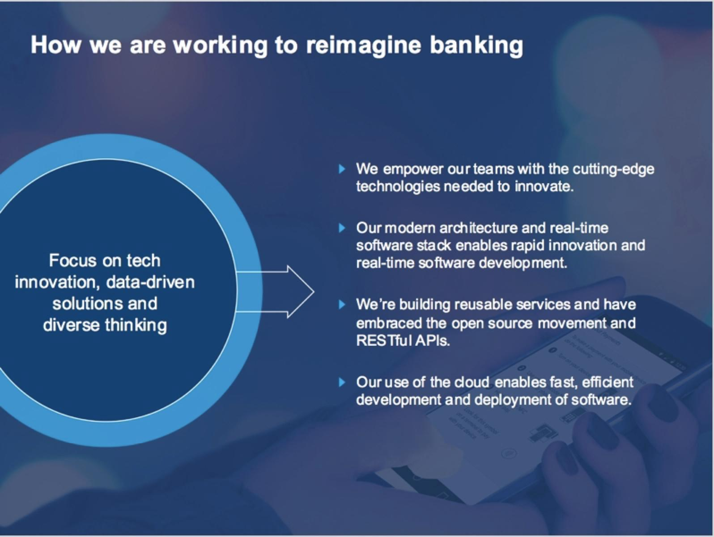
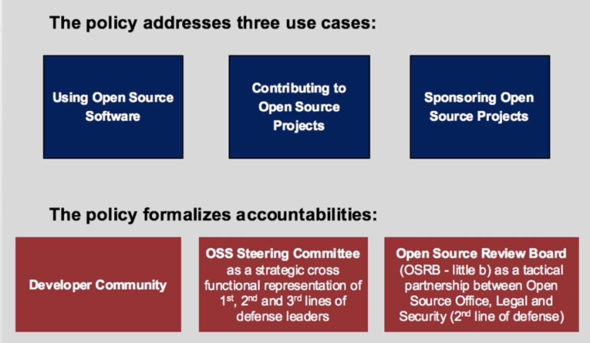
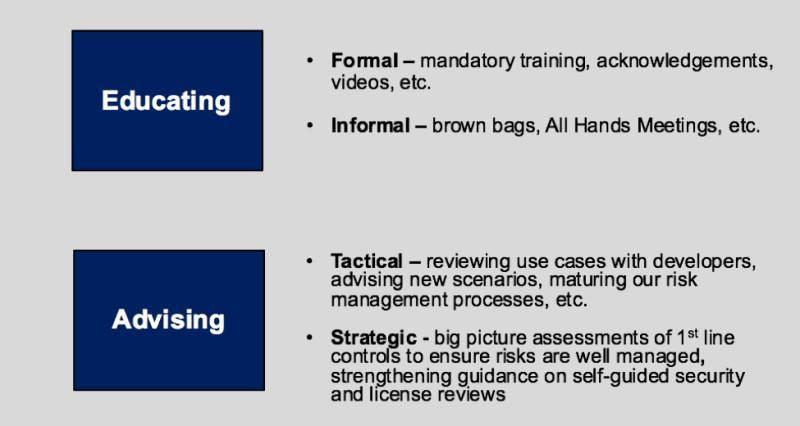

# Capital One: Open Source in a Regulated Environment

## Lessons Learned on Our Open Source Journey at Capital One

Most people know Capital One as one of the largest credit card companies in the U.S. Some also know that we’re one of the nation’s largest banks — number 8 in the U.S. by assets. But Capital One is also a technology-focused digital bank that is proud to be [disrupting the financial services industry](https://medium.com/capital-one-developers/we-re-a-disruptive-bank-a21f7cce25b6#.7swhf6tt4)through our commitment to cutting edge technologies and innovative digital products. Like all U.S. banks, Capital One operates in a highly regulated environment that prioritizes the protection of our consumers and their financial data. This sets us apart from many companies who don’t operate under the same level of oversight and responsibility.

Our goal to reimagine banking is attracting amazing engineers that want to be part of the movement to reinvent the financial technology industry. During interviews, they are often surprised to find we want them to use open source project and contribute back to the open source community. Even more are blown away that we sponsor open source projects built by our engineers.

*People expect that kind of behavior at a start-up, not a top bank. There is nothing traditional about Capital One and our approach to technology.*

When we see opportunities, especially in technology, we deliberately pursue them. Our approach to managing technology, guided by general industry regulations and company-specific policies, provide the guardrails for using, contributing to, and launching open source software projects. The Open Source Office adopted a comprehensive risk management approach wherein we have identified clear risk ownership around when to use, contribute to, and launch open source projects.

Our journey to managing open source risk and implementing this strategic approach followed this trajectory:

* Engineers wanted to use and contribute to open source projects.
* Risks were identified, analyzed, and a path to managing them was mapped out with the Open Source Office, Legal, and Security teams.
* Focus on education, with external partnerships providing guidance (Linux, TODO, etc.).
* Momentum increased as we matured our internal partnerships with Engineering, Legal, Security, and Audit Teams.
* Explaining and demonstrating our risk management approach to leaders secured sponsorship and resources.

### Organizing Into an Office

With strong leadership support, in 2015 we formalized oversight and governance through the creation of Capital One’s Open Source Office (OSO). With strong partnerships in Legal and Security, resources accountable for advising and overseeing open source activities were established within the OSO. 

Through these partnerships, the OSO team manages the company’s open source contributions, including these three crucial pillars:

* **Manage direction** — Policy, guidance, and education.
* **Manage connections** — Internal and external, as well as partnerships with Legal, Security, and other stakeholders.
* **Manage technologies** — Support open source processes and community needs.

As a horizontal function, OSO manages the direction and risk-based approach Capital One takes with open source. We collaborated to define a corporate level policy for Open Source Software and developed educational materials and videos to guide teams and individual developers on how to manage defined risks. On a daily basis, OSO team members, along with our partners in Legal and Security, work with engineers and data scientists to understand use cases and provide guidance on how to appropriately manage risk.

In addition to OSO managing internal connections with various teams in Capital One (Engineering, Legal, Trademarks, Security, Brand, Corporate Communications, Risk Management, Audit etc.), we actively manage our relationships with external communities such as the [Linux](https://www.linuxfoundation.org/) and [Apache](https://www.apache.org/)Foundations. We are also active members in the [Open API Initiative](https://www.openapis.org/), [Cloud Native Computing Foundation](https://www.cncf.io/) (CNCF) and the [TODO Group](http://todogroup.org/). We are also actively interacting with members of our own open source project communities (e.g. [Hygieia](https://developer.capitalone.com/opensource-projects/hygieia/) and [Cloud Custodian](https://developer.capitalone.com/opensource-projects/cloud-custodian/)).

### Formalizing Guardrails Through a Corporate Policy and Standard

In 2016, the OSO defined a corporate level Open Source Software Policy and Open Source Software Standard based upon an example from the Linux Foundation. The policy addresses three use cases and calls out the requirements to manage risk when:

1. Using open source software projects.
2. Contributing to open source projects.
3. [Sponsoring open source projects](https://developer.capitalone.com/open-source/)

The policy also formalizes accountabilities for the three main open source stakeholders at Capital One, including:

1. The developer/engineering community.
2. Establishes a new strategic partnership between from diverse groups called the Open Source Steering Committee.
3. Defines the tactical partnership between OSO, Legal, and Security within an Open Source Review Board.

As we developed this policy and formalized accountabilities, we established the tactical partnership between OSO, Legal, and Security as the OSRB. This tactical team works to guide open source activities with the development community. We also established a strategic leadership committee named the OSS Steering Committee, a group comprised of a dozen leaders who provide strategic direction for the development community.

### Taking it to the Next Level

As we look ahead in our open source journey, we plan to focus on:

* Continue to educate our growing technology organization.
* Strike a balance between managing risks and minimizing development bottlenecks.
* Further automate license and security scanning and integrate it into our build process.
* Establish and grow a robust governance function.

Specifically, in 2018 we’re focusing on education, strengthening awareness in the development community, and establishing our role as an advisor.

Collaboration among the multiple stakeholders has been key to navigating our open source journey. Capital One is a technology driven company and we are unified across our organization on taking our open source activities to the next level in 2018.

At the end of the day, we strongly believe in the benefits of involvement in open source projects. By managing the associated risks through policies, standards, and cross-departmental collaboration, the OSO allows Capital One to fully leverage our involvement in this community.

## Acknowledgments

Thank you to Nadine Hoffman and the Capital One OSPO for contributing this guide based on this [original article](https://medium.com/capital-one-developers/open-source-in-a-regulated-environment-dc4b4d9af3f8).