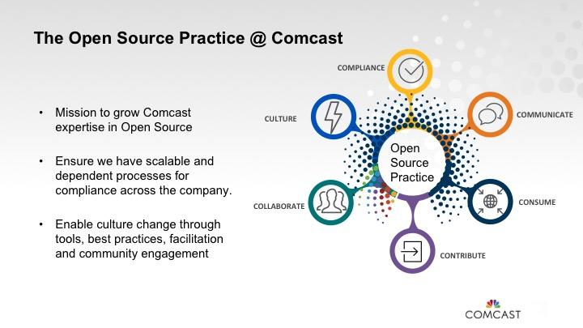
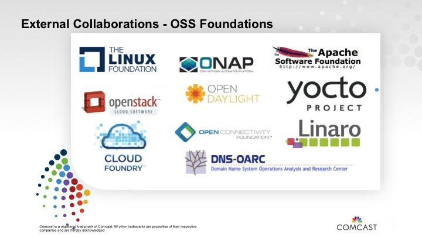

# Comcast

[Comcast](http://corporate.comcast.com/)’s involvement in open source was a gradual process that evolved over time. The company eventually created two open source program offices, one for the NBC business and another for the cable side of the business, which is the subject of this profile.

Comcast began contributing to open source around 2006 when Jon Moore, Chief Software Architect, made a patch contribution to Apache HTTP. He showed the management team that it was more cost effective to have the patch incorporated into the main project than it was to maintain it separately.

Working with an interdisciplinary team, Moore worked to set up an open source advisory council, which consisted of legal and technical subject matter experts. They reviewed contributions and created internal guidelines focused on good open source practices and community building. In 2013, when they started tracking these contributions, they had 13. This year, they plan to do almost 10x that.

> “When companies establish open source practices they send a big message saying that we're serious about open source and that we want to invest in it.”* – Nithya Ruff, Senior Director Open Source Practice at Comcast.

**Six C’s of Open Source Program Practice**

In 2016, Comcast hired Ruff to lead an increasingly vital open source strategy. The practice has support from the highest levels of the Comcast leadership team who wanted an organization that would field questions, educate employees, and create awareness.

The open source program practice currently has three full-time people while relying on functional experts in legal, engineering, IT, PR, and more to help scale the programs. The goal is to coach, guide, advise, recommend, and serve as a consultant to employees. Ruff summarizes the function of an open source practice with “the six C’s”: consumption, contribution, compliance, communication, collaboration, and competency-building.

The open source practice has two main goals.

1. Make it easier for people inside the company to work in open source. Whether it’s consumption of open source, contribution to open source, or collaboration with communities, foundations, and organizations, the goal is to remove legal, process, tool, communication, and awareness barriers.

2. Be visible externally in open source and technology communities. Many people don’t know that Comcast is a technology company with thousands of developers so they want to raise awareness and share what they’re doing.

**Open source contributions**

Comcast has [open sourced a few projects](https://github.com/Comcast) in addition to contributing significantly to existing open source communities, like OpenStack. [Apache Traffic Control](https://trafficcontrol.incubator.apache.org/) was started within Comcast and has been contributed to the Apache Software Foundation where it is currently in incubation.

They were also instrumental in setting up an independent consortia called the [RDK Management Project ](http://rdkcentral.com/)focused on creating a standard around set-top boxes. The RDK software uses the Yocto build system to create a consistent layer such that everyone from the semiconductor vendors right up the chain to OEMs and ISVs can use a consistent system and structure to build the content for set-top boxes and similar devices.

Comcast open sourced its [Speed-TestJS tool](https://github.com/Comcast/Speed-testJS), which is a test of internet speed, because the company wanted to be transparent to the world in terms of how they measure speed. The project also allows people to use the tool themselves to make sure that they felt that Comcast was delivering what it promised. This is a great example of a tool that could create more trust as a result of being open.

In addition to contributing to projects, Comcast is also a member of a number of foundations, including [Cloud Foundry Foundation](https://www.cloudfoundry.org/membership/), the [Apache Software Foundation](https://www.apache.org/), [The Linux Foundation](https://www.linuxfoundation.org/membership/), [Yocto Project](https://www.yoctoproject.org/), [Linaro](https://www.linaro.org/), [OpenStack Foundation](https://www.openstack.org/foundation/), [Open Network Automation Platform (ONAP)](https://www.onap.org/), and [OpenDaylight](https://www.opendaylight.org/).

Through these contributions, Comcast has benefited from the goodwill that comes from participating in open source communities. Comcast’s contributions have also helped the company recruit new developers. Developers today want to work for companies that are good open source citizens, and Comcast’s contributions in a variety of communities demonstrate that they are serious about their commitment to open source.

**Aligning with the Business**

> “The establishment of the practice, visible engagement at the foundation level, increased contributions, leadership support, and tooling support as a company have made it easy to do open source.*” – Nithya Ruff, Senior Director Open Source Practice at Comcast.

It’s important to make sure that your company’s open source strategies are closely aligned with its business strategy. The open source office should really understand the goals of the company and enable them in the open source strategy. This strategic alignment allows the open source practice to remain aligned with the broader company goals at Comcast to encourage long-term success for the practice and the company as a whole.

**Acknowledgments**

*For this feature we interviewed Nithya Ruff (@nithyaruff), Senior Director Open Source Practice at Comcast, to learn more about the Comcast’s open source program. Dawn Foster performed the interview. *
