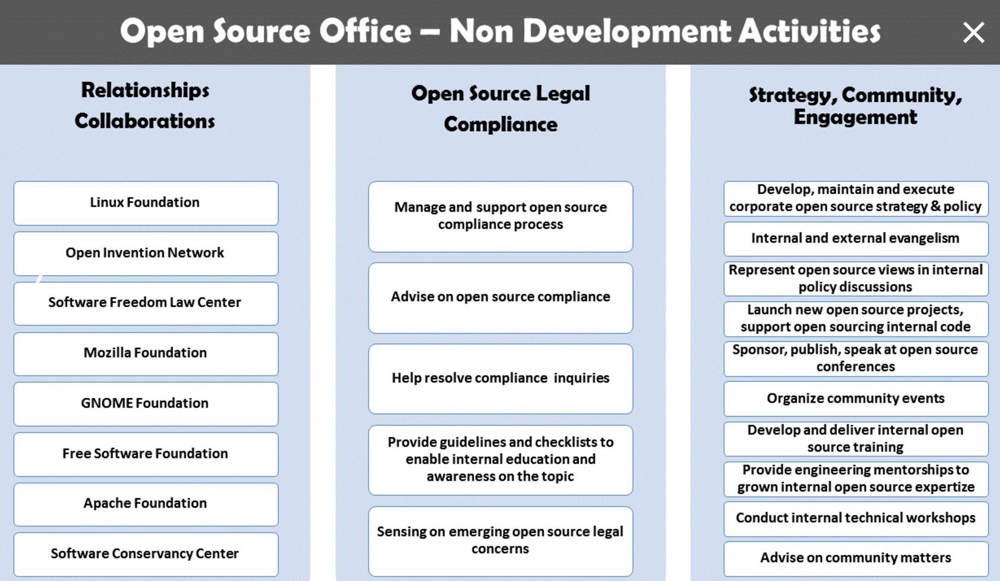

# How to Create an Open Source Program

A central open source program office is a designated place where open source is supported, nurtured, shared, explained, and grown inside a company. With such an office in place, businesses can establish and execute on their open source strategies in clear terms, giving their leaders, developers, marketers, and other staff the tools they need to make open source a success within their operations.

This guide aims to help you figure out why and how to establish a program to manage the open source use and creation inside your company, as well as to show how your developers can make their own contributions to open source projects outside your operations. It will cover topics for open source offices including: roles and responsibilities, corporate structures, elements of an open source management program, how to choose and hire an open source program manager, and more.

**Table of Contents**

- [Why create an open source program office](#why-create-an-open-source-program-office)
- [The role of the open source program office](#the-role-of-the-open-source-program-office)
- [Example: Open source program at Google](#example-open-source-program-at-google)
- [Establishing an open source office](#establishing-an-open-source-office)
- [Program Structure](#program-structure)
- [Management roles](#management-roles)
- [Setting policy and processes](#setting-policy-and-processes)
- [Final words](#final-words)
- [Example open source program job listing](#example-open-source-program-job-listing)
- [Acknolwedgements](#acknolwedgements)

## Why create an open source program office

Open source software is widely used today by companies in a broad range of industries from retail to finance to automotive, and more. However, it’s not always fully understood by the executive leaders and decision-makers running the operations.

A key problem is that, while enterprises develop and follow traditional business plans which dictate their operations and goals, open source software can be baffling. Open source innovation has a methodology of its own and doesn’t follow traditional business processes. One of its biggest differences is that open source development is collaborative, while traditional software and business practices are proprietary and closed. For many businesses, the needed change in philosophy when approaching open source use doesn’t come easily or naturally.

That’s where the creation of an open source program can be a major boon. By creating an open source program office, businesses can enable, streamline and organize the use of open source in ways that tie it directly to a company’s long-term business plans. An open source program office is designed to be the center of the universe for a company’s open source operations and structure, helping to bring all the needed components together.

This can include setting code use, distribution, selection, auditing and other policies, as well as training developers, ensuring legal compliance and promoting and building community engagement. The office can also provide advocacy and communications about all things open source inside and outside the company.

> “The open source program office is an [essential part of any modern company](https://opensource.com/business/16/5/whats-open-source-program-office) with a reasonably ambitious plan to influence various sectors of software ecosystems. If a company wants to increase its influence, clarify its open source messaging, maximize the clout of its projects, or increase the efficiency of its product development, a multifaceted approach to open source programs is essential.” – John Mark Walker, founder of the Open Source Entrepreneur Network (OSEN).

## The role of the open source program office

Ultimately, a well-organized open source program office is valuable because it can advance open source use, contribution, and creation inside companies for strategic advantage.

A successful office can greatly benefit corporate open source use by establishing processes that enable developers and their teams. It encourages standard coding and organizational practices, processes, and toolsets. At the same time, a program office can help avoid or remove unneeded, rigid processes which creative developers may circumvent or ignore anyway, threatening security and other aspects of projects.

The responsibilities of a program office are varied. These include:

* Clearly communicating the open source strategy within and outside the company
* Owning and overseeing the execution of the strategy (see our guide to creating an open source strategy for business)
* Facilitating the effective use of open source in commercial products and services
* Ensuring high-quality and frequent releases of code to open source communities
* Engaging with developer communities and seeing that the company contributes back to other projects effectively
* Fostering an open source culture within an organization
* Maintaining open source license compliance reviews and oversight

For every company, the role of the open source program office will likely be custom-configured based on its business, products, and goals. There is no broad template for building an open source program that applies across all industries — or even across all companies in a single industry. That can make its creation a challenge, but you can learn lessons from other companies and bring them together to fit your own organization’s requirements.

> “There isn’t a one size fits all model. I can’t stand up in front of a crowd and say, ’this is how you should do it,'” – [Jeff McAffer](https://twitter.com/jeffmcaffer), director of the [Open Source Programs Office at Microsoft](https://opensource.microsoft.com/resources/office).

Microsoft has been working over the last several years to create and refine its own open source approach. With tens of thousands of employees in a wide range of business units, Microsoft’s dedicated open source program office works to assist developers, marketing teams and others who are engaging with open source for cloud services, hardware and software products, games, content, media, and other product lines. Each division requires different assistance based on its individual business models and engagement scenarios, making it impossible to serve them all with the same offerings.

A key role for the open source program office is to bring substance and facts to the conversation when business units begin to consider open source in their plans so there is a full understanding of why it is being considered, what the consequences will be, and what is needed to reach its goals. It’s often a matter of framing the conversation so that stakeholders know where to start and what to think about as they weigh their decision.

The program office can also be a critical liaison between developers and the open source user communities to resolve and understand issues or requirements that arise. The program office can assist with legal issues, provide developer advocacy, and act as a voice for external users who are building on a company’s open source projects. The program office can also help relay that information to others inside the company, including the product management team, to further advance the code. In addition, open source offices are increasingly hiring dedicated developer advocates to focus on making sure that their projects grow and are sustainable.

## Example: Open source program at Google

At Google, where the use of open source has been central to its mission and success since the company began in 1998, the role of the open source program office is broad. The office was started in 2004 largely as a compliance effort to understand and organize its use of open source licenses and code, according to Will Norris, the manager of the office. Google was much smaller back then and was involved in a wide range of open source projects and code use, but there weren’t many formal compliance processes in play at that time. As the company continued to grow, that lack of compliance and organization had to change, said Norris, who has worked in the office for four years, originally as a software engineer. He became its manager in September 2016.

Google runs its open source program office in adherence to three important principles aimed at helping its employees use open source and release open source back to the community, and to support the broader open source ecosystem around the world. That mission has remained constant since the creation of the office, which has only about 15 team members who serve a company with about 72,000 employees.

Much of its efforts to keep the open source ecosystem healthy involve hiring qualified and experienced engineers to work on projects, investing sizable amounts of the company’s money in the open source foundations, groups, and projects that need it, while also regularly sponsoring technology conferences which spread the gospel and usefulness of open source software creation.

It also means developing and running programs like [Google’s Summer of Code](https://summerofcode.withgoogle.com/) which provides opportunities for students at accredited universities and colleges around the world to spend their summers creating code with help from mentors who provide training and guidance.

For Google’s open source program office, the Summer of Code is an example of a program which provides direct benefits for its investments – a stream of potential future developers who can one day come to work for the company, armed with experience and some real-world knowledge of how it does open source development. In the open source world, that same strategy can benefit many other companies through similar open source program office investments in the communities in which they participate.

Most open source community management at Google happens within its many product teams, with the open source program office giving teams and projects support to follow the paths they want to take. The business goals vary for individual projects based on whether it makes sense to open source a project in each case. Some 2,000 to 4,000 open source projects are typically underway at once at Google.

> “We allow the various business units around the company to make the decision on whether it makes sense to open source a given project from a business perspective, because there’s a lot of different reasons why you might open source a project or a piece of code. We’re comfortable with allowing projects to take the approach that works for them given their goals. We play more of a role of facilitating and advising.” – [Will Norris](https://twitter.com/willnorris?lang=en), open source office manager at Google.

The Google program office is made up of a compliance team which includes two lawyers, an outreach team for event participation and an engineering team that builds tooling to automate compliance checks and support the company’s development programs. Another of its important responsibilities is carefully and constantly tracking a wide range of statistics on open source use, including what needs to be built to be compliant and how long it takes for code to be released or brought in.

A recent role being taken on by the Google program office is an interesting initiative which is encouraging all workers who are responsible for open source in their primary jobs – whether they are graphics designers, tech writers, marketing people or developers – to spend up to 20 percent of their time to do their specific job for other projects within the company. The idea is to foster more cross-collaboration between teams, which can help them understand each other and improve projects across the board.

## Establishing an open source office

For every company, this is where the individualized decisions begin. The process can start from the top down, with buy-in from top management; or from the bottom up, where pockets of developers and open source enthusiasts have been using open source and want to see it formalized. It can manifest itself as a desire to create guidance around legal issues and security, or it can start as a grassroots effort that matures and attracts the attention of corporate leaders. It can even start with a forward-thinking CEO or CTO who champions the cause to drive the company forward and add value by deepening its commitment to open source. That kind of consensus and executive support will be essential to gain traction and move the project forward.

So where do you start your open source program office journey? Here are some critical steps to follow:

### 1. Find a leader

Regardless of how your planning starts, it’s important to find the right leader to help develop and then run the fledgling program office inside a company. The top candidate will have a detailed understanding about how open source works, along with some technical chops from working as a developer, contributor, or committer on existing open source projects. They should have a broad understanding of your company’s business along with the business acumen and management skills to help inform strategy and plan across business units. And they need to be sociable so they can convey enthusiasm, knowledge, and information to others and help them understand how the open source initiative is going to transform, change, and improve things for the company. The head of the program office needs to be able to talk with people about the deep technology, but they don’t have to know the ins and outs of every technology at play because there are just too many to master.

In the spirit of open source collaboration, a plethora of online resources exists to help find the best candidates including [detailed sample job description postings](https://github.com/todogroup/job-descriptions) for [open source program managers](http://todogroup.org/blog/sample-job-req/) and other leaders from a variety of companies that established such roles, including Capital One, Box, VMware, Microsoft, Twitter and Yahoo.

### 2. Define your operations

The budget, staffing, and technology tools and systems needed by a new program office are also key issues to resolve in establishing its operations. Some companies begin with a part-time manager, but learn they will only get so far with that approach. Making the position someone’s full-time job is a solid step to get the program off the ground, along with a small support staff to keep it nimble.

If a program office is too large, there’s a danger it can become too centralized. You want to keep developers and open source communities within the company in the process as much as possible. Outsized offices allow others to defer issues to the program office rather than resolving them on their own.

An example of a well-defined open source program office is one that drives needed policy, processes and tools, while also operating with a mantra of eliminating friction where it is found, using tools to automate what can be streamlined, and delegating tasks which need to be accomplished. We’ll cover more specifics on how to set policies and processes in the sections below.

A program office must offer structured policies and processes but also remain flexible. When open source users and contributors need help, the office operates more like a consultancy, providing guidance while still allowing employees to make individual or group business decisions relating to their work. Ultimately, the goal is to establish the right balance of duties and responsibilities to meet the needs of your company and its open source users.

### 3. Seek feedback and buy-in

Establishing an open source program office isn’t something that should be done in a vacuum. Because it will have a central role in your business, creating it successfully will require open and honest input and feedback from all involved parties inside enterprises. Making sure that everyone from the executives to the developers have a say in its creation will help give the effort broad-based support.

> “If your goal is to really get a handle on what your company is doing with open source, in both directions – releasing and bringing it in – it really requires thinking about what are the core things that you really, really care about. Keep your process as streamlined as possible to focus on those things and then on top of that, automate as much as you possibly can.” – [Will Norris](https://twitter.com/willnorris), open source office manager at Google.

## Program Structure

So how and where should open source program offices fit inside a company’s organizational structure? Should it be inside the engineering department? Or in the legal department, the CTO’s office or in another specific business unit? Again, that depends on your company’s primary business and your open source strategy.

### Legal

For companies that have large intellectual property portfolios, that could mean the open source program office might be a perfect fit in the legal office, where developers can work closely with the legal team on issues that arise. That might be a good fit for a hardware company because it’s always concerned about potentially running into IP-related legal issues.

### Engineering

Other companies are more engineering-driven, so they choose to maintain their open source program offices within their engineering departments. That allows them to focus their efforts directly on making their developers more effective and productive in their work.

### Developer Relations, Marketing, or Communications

In other cases, some open source offices are located inside the marketing wing of organizations because they use open source to funnel leads aimed at selling the products they build using open source.

At Twitter, where open source use has been integral to the company’s success, developers were finding it difficult to contribute back to open source projects starting in 2010 because the company’s legal department had serious concerns about code licensing and related issues. Developers and software engineers responded by seeking ways to automate the license compliance processes – to “grease the wheels” – to alleviate the concerns of the legal and engineering departments. The result was the hiring of an open source program manager and the creation of an open source program office to fix processes, streamline procedures, bring in tools to automate tasks and make other needed changes.

Intriguingly, Netflix took a different approach and chose not to create or use a centralized open source program office, says Andrew Spyker, the manager of the company’s container cloud. Instead, the streaming movie and entertainment company organizes its open source use through a [small, cross-functional working group](https://www.youtube.com/watch?v=oq__rmr0Qe8&t=547s) that runs an internal mailing list for discussions and meets informally once a month to help each other resolve open source issues. The volunteer working group members assist other decentralized teams, leaving everyone with less need to focus on administrative tasks such as legal issues, tools, monitoring and community promotion. For Netflix this is a workable approach because it’s an entertainment company and not a software company.

At Microsoft, the structure of its open source program office, which is inside its engineering department, is unique because it has some 60,000 software engineers to support. That large number of developers required a move away from the idea that the details of all open source projects would have to go through one centralized office, which would have been overwhelmed and unworkable. Instead, for things that can’t be automated, the company’s open source program office team enables engineers to make local decisions about their projects, rather than having to attempt to navigate a centralized bottleneck that could gum up the operations.

Under its process, Microsoft engineers can go into the company’s open source workflows, share that they want to use a piece of code or release something to an open source community, and then receive responses from local reviewers who provide feedback. About 300 different groups of business and legal reviewers are available to weigh in on the localized requests with their expertise, helping to provide a workable approach for the company through a highly specialized process.

> “If we tried to have a centralized body to approve open source for Windows, Office, and Azure, we would be pulling our hair out. Those are fundamentally different businesses. We give **engineers** the tools and guidance to enable their work, but are not a **central approval body**. That works in some companies but would not work here.” – [Jeff McAffer](https://twitter.com/jeffmcaffer), director of the [Open Source Programs Office at Microsoft](https://opensource.microsoft.com/resources/office)

## Management roles

In creating an open source program office, decisions also must be made to establish the roles and responsibilities of the open source program manager, the company’s legal team, and any review board made up of engineers and executives.

### Program Manager

For maximum effectiveness, the program manager should be empowered as an executive-level position with direct oversight and hands-on management of the company’s interests in its open source activities. That would give them the tools they need to lead the way inside an enterprise toward its open source goals and vision.

Microsoft uses an Open Source Executive Council, which is similar to a review board. The group, which is made up of vice presidents from all the major business units inside the company, provides board of directors-style guidance on policy changes and introductions, sets priorities for the open source program, and assists in driving changes in behavior.

### Legal

Like every other function inside a company, legal teams must have a say in the operations of the open source program office to ensure compliance with laws, open source licensing agreements, and other legal details. Specific to open source, the legal team needs to be responsible for ensuring that a company can consume code internally and contribute back to projects with acceptable terms. Larger organizations should consider hiring or training a dedicated attorney to advise their open source program. But you could also use a part-time, knowledgable staff member or outside counsel. It is often helpful to work with an attorney who is knowledgeable and experienced with open source licensing and IP as it can be a specialized, and at times baffling, legal domain relative to commercial contracts or standards.

### Compliance Team

The open source compliance team is a cross-disciplinary group consisting of various individuals tasked with the mission of ensuring open source compliance. The core team, often called the Open Source Review Board (OSRB), consists of representatives from engineering and product teams, one or more legal counsel, and the compliance officer (who is often the open source program manager).

The extended team consists of various individuals across multiple departments that contribute on an ongoing basis to the compliance efforts. These may include documentation, supply chain, corporate development, IT, localization and an Open Source Executive Committee (OSEC). However, unlike the core team, members of the extended team are only working on compliance on a part-time basis, based on tasks they receive from the OSRB. Samsung program manager Ibrahim Haddad’s book, [Open Source Compliance in the Enterprise](https://www.linuxfoundation.org/publications/open-source-compliance-enterprise/), provides a detailed discussion on the roles and responsibilities of individuals involved in achieving open source compliance.

### Developer Relations, Advocacy, and Evangelists

Open source developer relations and evangelists can be important to a fledgling open source program office because they can work to build interest and enthusiasm within a company’s developer community for specific projects, which can help grow the efforts and increase teamwork among engineers. Evangelists often go to conferences and tech events and explain what open source is to help audiences understand how it can be used and what challenges and opportunities it offers, while sharing their corporate experiences with the open source community.

### Others

In addition, the creation of other job roles is important for the success of the open source program office, including tool administrators, training managers, integration developers for tools and systems, deployment support staffers, implementation project leads, and open source evangelists. Tool administrators, for example, are needed to help select, provide and integrate needed tools for engineers working on their open source projects, while also ensuring the tools meet the licensing and other requirements of an enterprise.

## Setting policy and processes

With many of the other important components now planned or assembled for your company’s open source program office, from its creation to its structure to personnel, the next step is to develop well-defined policies and processes which will enable consistent implementation of your company’s open source strategy.

The policies should lay out the requirements and rules for working with open source across the company, as well as documented and executable processes which will ensure the rules are followed on a day-to-day basis.

Crucially, they should require minimal overhead. Microsoft looks at its open source program office policies and processes with the goal of making them as unobtrusive as possible for developers and other team members. The approach is to repeatedly eliminate, automate and delegate when reviewing existing open source policies and processes so the rules are constantly questioned and updated to streamline procedures. That means asking why policies are even in place and how they can be improved for users.

> “Having a well-defined policy in place, that’s great, but it’s got to be a well-defined minimal policy. Otherwise you get lawyers, security folks, business folks, all piling in their concerns and constraints. Soon you end up with a strait jacket full of policy that basically means that nobody can do anything.” – [Jeff McAffer](https://twitter.com/jeffmcaffer), director of the [Open Source Programs Office at Microsoft](https://opensource.microsoft.com/resources/office)

Even as those rules are carefully created for open source program offices, companies must be prepared to evolve and modify the rules and procedures as needed over time as their businesses change and as their open source engagements mature and grow.

This may sound like yet another daunting step in the process, but like open source code itself, sample rules and processes are available from open source silos and can be implemented and customized by enterprises, making your tasks easier.

Among the best examples of such rules are from Google, which early in 2017 published its [open source policies](https://opensource.google.com/docs/) for review and free use so others can learn how the company uses, releases and supports open source and how it’s involved in projects and communities. Some of the content is scrubbed for security and privacy reasons, but it provides many lessons learned in how the company does its work.

When drafting open source policies, among the many topics that need to be discussed are:

* How your company accepts external contributions to their open source projects
* How to prepare for open source releases
* How approvals are received
* How developers can use open source code they find on GitHub and other code repositories
* Procedures and rules explaining how open source code can be brought into your company
* How the incoming code is catalogued so others know it is being used
* How a company can grow a community of like-minded external developers around it to keep it thriving
* Rules that help determine when code should be released as open source or kept as intellectual property

### Policies for releasing code

You want to help people be successful in making contributions to open source projects and in releasing their own projects. Guidelines and checklists ensure that developers have everything they need to release their code as open source without running into licensing or confidentiality issues. Especially for new contributors, it can also help to have an internal review process available as a safe place to get feedback before making a contribution. (See our guide on Participating in Open Source Communities.)

Your organization should also strive to adopt an “upstream first” development policy. By submitting patches to the upstream open source project first, and incorporating them into your own products downstream, you will avoid spending a massive amount of time and money on re-engineering after each release.

### Policies for accepting contributions

Unless your open source projects are housed at a neutral foundation, you’ll want to [...] Rules that set out procedures for your company to receive contributions to your own open source projects from external developers are particularly important.

> “You actually don’t want to be the only people contributing to your open source project. You want to have people outside your company contribute to your open source project, because at the end of the day, there’s no way to hire all the smartest people in the world. It’s impossible. Even if you’re Google, it’s still impossible.” – [Chris Aniszczyk](https://twitter.com/cra?ref_src=twsrc%5Egoogle%7Ctwcamp%5Eserp%7Ctwgr%5Eauthor), COO of the Cloud Native Computing Foundation.

That is, of course, one of the benefits of putting your company’s open source code out into other communities and inviting other developers to establish an interest in your own projects. Because in the grand scheme of things, even though they are not officially your employees, you can have brilliant people working on your company’s code from around the world, making it better and expanding its capabilities. This kind of collaboration is important for companies and is a common focus for many open source program offices.

### Policies to promote adoption

You also want to encourage others to use your code in their products and services. This is key to building ecosystems that in turn help grow and sustain your open source projects. Policies for open source use can come in a variety of innovative forms.

Red Hat has a unique policy by defaulting to open source with its newly-created code in most cases from the start. That means that when developing each piece of software inside the company, it is assumed that in the future it may be destined to be released as open source. This is intriguing because typically there is a different attitude among engineers for releasing their code as open source because other people will then be looking at it. Due to that scrutiny, they tend to structure things in better ways when writing open source, creating cleaner code with fewer or improved code dependencies in their work.

### Policies for internal consumption

Other needed policies include rules about how and where your team finds trusted sources for open source software use and creation, policies about establishing code management and maintenance procedures, and formalizing community interaction for your projects. (See our guide on Using and Distributing Open Source Code.)

An open source usage policy ensures that any software (proprietary, third-party, or open source) that makes its way into the product base has been audited, reviewed, and approved. It also ensures that your company has a plan to fulfill the license obligations resulting from using the various software components, before your products make it to customers.

For example, your policy could require engineers to receive approval from your organization’s auditing staff, such as an open source review board (OSRB), before integrating any open source code in a product. It may also state that software received from third parties must be audited to identify any open source code included, which ensures license obligations can be fulfilled before a product ships.

### Policies for compliance

Also needed are policies to formalize and establish legal compliance procedures and to assure executive oversight for the program. (See our ebook, Open Source Compliance in the Enterprise, for a detailed compliance program.)

You’ll also want to map out how you’ll handle the software tools that will make much of the compliance and code testing work possible by automating it and streamlining procedures for developers and contributors. For example, the [I think we need to mention SPDX and OpenChain tools from The Linux Foundation, along with help from your and working with internal supply chain teams, will internally to ensure that code brought in by third parties is also compliant.]

There’s a broad array of open source (e.g. FOSSology) and fee-based proprietary tools in the marketplace today that can help with these important tasks. For most open source program offices, a high-quality and comprehensive collection of tools can be brought together without the need to build your own custom tools. Again, much of this is due to open source collaboration, where contributing developers have created and refined the tools which can handle these tasks for enterprises. And if the tools don’t do exactly what your project needs, then users can contribute back to modify and improve them to gain the capabilities they seek. Getting involved in the open source community around enterprise tooling is something that your open source program office will likely support.

Existing open source resources are also potential gold mines for finding other materials needed by your open source projects, including documentation for contributor license agreements (CLAs). CLAs “define the terms under which intellectual property has been contributed to a company/project, typically software under an open source license.”[[https://en.wikipedia.org/wiki/Contributor_License_Agreement](https://en.wikipedia.org/wiki/Contributor_License_Agreement)] Projects that use CLAs require contributors, and often their companies, to sign the CLA before contributions will be accepted by the project.

Many companies have written their own CLAs, but generic versions are available as open source agreements which one can use without starting from scratch. Most of what you will need can be found in a template and then you can customize the CLAs to cover any issues that remain. Attorneys from other potential contributing companies will often appreciate reuse of standard terms.

Google regularly uses a variety of tools to perform automated code checks using features such as custom filters, which can scan code bases to check for licenses, license compatibility, and other factors. Each time Google releases a new version of Android or other application, it undergoes an automated process for checking license compliance, simplifying procedures for the company. Automation quickens making the argument to engineers that the process is simple and seamless and won’t burden them to use for their applications.

All new Google engineers are also required to go through a one-hour open source class where licensing and compliance are stressed as part of how the company does business. A key lesson shared by the company is that not only is Google obligated by licensing legalese to comply with licenses, but that it also complies because it’s the right thing to do for the community. Google’s lawyers are available to represent the company if an obvious mistake is made in licensing or code use, but the company is very sensitive about potentially submitting code that could harm its standing in the community.

> “Angering our friends in the open source community would be devastating. It’s not something we would ever want to do because we care about this community, we’re part of it. For companies that are new to open source, I think they often fail to recognize the importance of that.” – [Will Norris](https://twitter.com/willnorris?lang=en), open source office manager at Google

## Final words

There’s a lot of work to do and much to consider when your company decides to create an open source program office, but its value will likely outweigh the efforts taken to accomplish it. Finding just the right leader to drive the program office initiative is a critical step in the process to make it a success.

> “This is a culture change endeavor. The code is obviously a big part of it, but the community and the engagement is a people-to-people thing. If you’re going to start an open source program office and you’re going to try to make it a real thing, you’re going to need to understand the culture and get somebody in place who can help drive that culture to a new level. Your head of open source is really a change agent.” – [Jeff McAffer](https://twitter.com/jeffmcaffer), director of the [Open Source Programs Office at Microsoft](https://opensource.microsoft.com/resources/office)

## Example open source program job listing

If you’re interested in building out and open source program office and want to hire for the role, we advise taking a look at a template from the TODO Group along with real example job descriptions:

https://github.com/todogroup/job-descriptions

## Acknolwedgements

Contributors to this guide:

* [Chris Aniszczyk](https://twitter.com/cra), COO of CNCF (former head of open source at Twitter)
* [Jeff McAffer](https://twitter.com/jeffmcaffer), director of the [Open Source Programs Office at Microsoft](https://opensource.microsoft.com/resources/office)
* [Will Norris](https://twitter.com/willnorris?lang=en), open source office manager at Google
* [Andrew Spyker](https://twitter.com/aspyker), container cloud manager at Netflix

*These resources were created in partnership with the TODO (Talk Openly, Develop Openly) Group – the professional open source program networking group at The Linux Foundation. A special thanks goes out to the open source program managers who contributed their time and knowledge to making these comprehensive guides. Participating companies include Autodesk, Comcast, Dropbox, Facebook, Google, Intel, Microsoft, Netflix, Oath (Yahoo + AOL), Red Hat, Salesforce, Samsung and VMware. To learn more, visit: [todogroup.org](http://todogroup.org/)*
