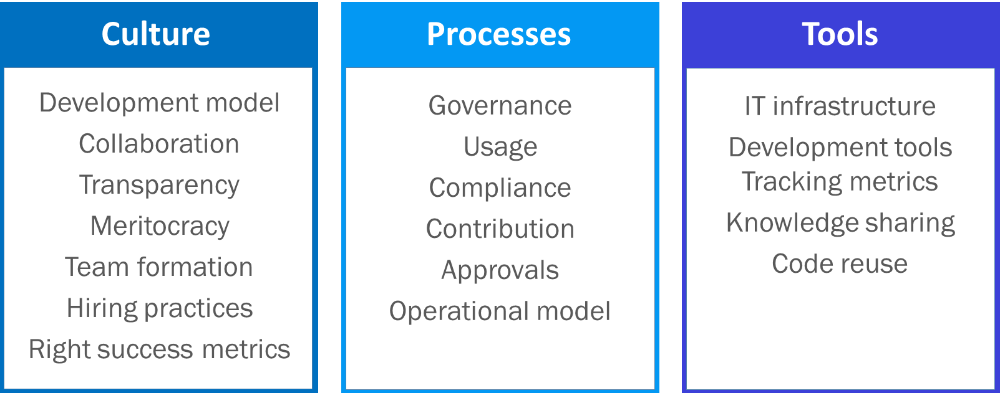
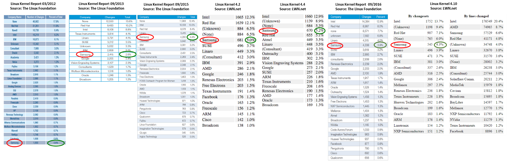

# Improve Your Open Source Development Impact

Open source development requires a different approach to software engineering than many organizations are accustomed to. It becomes easier if you have a clear plan to follow. Fortunately, many companies and individuals have already forged a path to success by contributing to significant open source projects in strategic ways. This practical guide will help you and your company improve your internal development process and prepare you to contribute to the open source projects that matter most to your company. Contributing to the Linux kernel is one of the hardest challenges for open source developers. So we’ll use this case as an example for this guide. Fortunately, the guidance will apply to nearly any open source project you’ll face.

## What is impactful open source development?

Developer contributions are one of the primary ways that your open source program will achieve the business goals you’re supporting with your organization’s open source strategy. There are many ways to influence the direction of an open source project, from testing code in different environments and adding to the code documentation, to funding the project or foundation and participating on the project board, or by using the code in other open source projects. But your company will exert the greatest influence in open source projects through the quality, quantity, and consistency of its code contributions. So it is in your organization’s best interest to provide the tools and processes that will help your team develop high-quality, effective open source code.

Impactful open source code can influence the technical direction of the open source projects you contribute to, which in turn improves your products while minimizing the cost of maintaining that code.

The goal is to improve your development team’s efficacy through and with open source contributions. By helping your organization implement some of the recommended open source development best practices laid out below you can:

* Reduce the amount of work needed from product teams
* Minimize the cost to maintain source code and internal software branches
* Improve code quality
* Produce faster development cycles
* Produce more stable code to serve as the base for products
* Improve company reputation in key open source communities.

## The role of an open source program in improving development

Your open source program can have both direct and indirect positive impacts on your products – whether they are consumed internally as infrastructure or services, or shipped as a commercial offering. These are impacts that you can measure and improve. They also provide tangible results to report to executive leadership – helping to show the value of your open source program and deliver ROI.

## Direct enablement

Your open source program can directly impact your organization’s open source code development by contributing the code itself. Every company structures its open source program and engineering contributions according to what best fits its own business goals and corporate structure (See the [program structure section](https://www.linuxfoundation.org/creating-an-open-source-program/#4) in our guide on Creating an Open Source Program). But contributing code is the best way to gain influence in an open source project and build your company’s reputation in the open source community.

At Samsung, the open source program has its own dedicated engineering team which fulfills open source development requests from the company’s R&D and product teams. The program also helps bring internal Samsung code into various open source projects. And it has implemented numerous drivers related to Samsung products into upstream code. Product teams have their own developers who contribute to open source projects but they have less freedom as they are tied to product development. So the open source group receives requests such as “we need feature X implemented in the Kernel” and their engineering team delivers the code to product and to the Linux kernel.

> “Our expertise in committing code upstream has made us particularly valuable with these open source components, and our efforts have resulted in a reduction in the amount of effort required to maintain kernel code that’s used in Samsung products and services.” – [Ibrahim Haddad](https://twitter.com/ibrahimatlinux), Vice President of R&D and Head of the Open Source Group at Samsung Research America.

Open source program offices that are focused only on policy and process don’t always have a dedicated engineering team for contributing code. Instead, engineers across departments allocate a portion of their time to pushing code upstream for any changes they make to open source components.

Regardless of how the engineering team is structured, the goal is to minimize the technical debt with respect to those components. If upstream contributions do not happen, the product team will be stuck with large code bases that are out of sync with upstream. They’ll spend their time back-porting the updates to their out-of-sync fork instead of advancing the product.

Often an open source developer embedded in a product team will have a hard time striking any balance between upstream work and responsibilities (as a committer or maintainer) and their role in making the product happen.

Each open source program office is uniquely structured depending on the needs of the business. Facebook, for example, has a dedicated Tools team within the open source program office that is responsible for building internal tools to help manage its open source portfolio. This includes the projects that Facebook shares, which are mostly hosted on GitHub, as well as the other external projects they contribute to such as the Linux kernel. (See our case study on [Facebook’s open source program](https://github.com/todogroup/guides/blob/master/casestudies/facebook.md).)

## Indirect Enablement

The open source program’s impact goes beyond the code the organization contributes to the various open source projects, however. From public relations and marketing, to legal support, developer training, and more, an open source program enables development in myriad ways. Here are four ways that the program can indirectly improve development through non-code contributions:

1. **External technical discussions.** One major area to make indirect contributions is by influencing the various communities through participation in technical discussions. Your open source developers can do this by being active on mailing lists and IRC chats to participate in discussions and stay informed on the latest project updates. And on larger projects with formal governance structures you can sit on technical steering committees.

2. **Internal technical discussions.** Internally, open source developers can participate in policy and architecture discussions to ensure the organization’s decisions match the direction of a specific project community. Open source developers should be present for any strategy discussions related to long-term planning for products that rely on open source code, for example.

3. **Compliance support.** Program managers can also provide assistance to resolve compliance issues and support the compliance team with the open source compliance inquiries they receive.

4. **Bug fixes.** Finally, you can also help stabilize the code of the various open source projects you’re involved in. Find and fix bugs, test the fix and submit it upstream. This improve the code’s overall value for all the project’s users, including your company.

## Common areas for improvement

There are three general areas in which open source programs can improve developer productivity and efficacy in open source projects: culture, processes, and tools. Within each of these categories, there are several elements that you will need to address to fit the open source model.

### Challenges open source dedicated teams face in an enterprise setting

#### Culture

Cultural challenges often stem from the fact that there is a gap between traditional software development practices and the requirements of open source development. You can bridge this gap by hiring open source experts and having them train other groups that aren’t familiar with the open source development model.

> “We aim to also provide open source engineers with adequate time to fulfill upstream responsibilities so they can provide adequate open source leadership for Samsung.” – Ibrahim Haddad, Vice President of R&D and Head of the Open Source Group at Samsung Research America.

#### Processes

Open source development is dynamic, moves very quickly, and has special requirements for compliance. Companies that don’t adapt their internal processes to meet this type of development can easily get left behind. Developers need to be enabled to contribute code upstream quickly and any internal code policies need to be modified to allow this.

First, it’s vital to have a team in charge of maintaining proper open source compliance to avoid legal problems. (See our ebook, [Open Source Compliance in the Enterprise](https://www.linuxfoundation.org/publications/open-source-compliance-enterprise/).)

You’ll also need to have a simple internal approval model for open source use and contributions. Throughout the years, Samsung has moved from highly complex and cumbersome policies to a more simple approach for receiving, reviewing, and approving source code contributions. It’s a function of balance between all parties involved: legal, engineering, and open source. The compromise we have now supports the dedicated open source team which has a blanket approval to contribute to a number of open source projects. This is not the case for other teams who need to get different levels of approval depending on the nature of the code being contributed (e.g. simple bug fixes, code to improve existing functionality, code that offers new functionality, or starting a new project).

#### Tools

You’ll also want to ensure your tools are compatible with the open source development model from the start. Create a setup that fulfills the needs of the open source program office and also meets corporate IT guidelines.

Samsung, for instance, issues Linux devices that work with all of the tools its engineers need to participate in open source development. This environment allows developers to join the team without requiring any major changes to the way they work. They also support work from home and in fact have only very few open source developers in their Silicon Valley offices – all other staff are remote across the globe.

## Top Recommended Practices

First, a bit of history. December of 2000 marked a major milestone in the history of open source when IBM pledged to spend $1 billion on Linux R&D. IBM was a true pioneer in the enterprise world putting its bet on Linux and open source when very few companies did – and definitely not at that scale. IBM had to learn a lot about working with open source software and the various project communities they were involved in.

That was the starting point for enterprise open source and companies have since followed IBM by the dozens and then hundreds. Yet, thousands of companies are still entering open source as it is becoming the new normal of software development. The question is: How can we minimize the enterprise learning curve and speed up the process of “getting it right?”

The answer is easy, but the application of that answer to specific company culture is the hard aspect. Let’s explore some of the “easy” aspects of learning from over 17+ years of enterprise experience with open source software. You’ll get to deal with the hard aspect of applying those lessons to your particular enterprise environment.

A word of caution: In addition to implementing these practices, you will need to lead a cultural shift from traditional software development practices to a more open and collaborative mindset. Internal company dynamics need to be favorable to open source efforts. As an open source leader inside your organization you will face several challenges in terms of funding resources, justifying ROI, getting upstream focus, etc. These often require a major shift in mindset and a lot of education up the chain.

### 1) Hire key developers and maintainers from the project’s community

It takes considerable time to grow internal open source expertise. Hiring key developers is a critical step that allows your organization to quickly gain skills and recognition.

Two or three people are a great start towards making a noticeable impact in a large project such as the Linux kernel, attracting further hires, and allowing enough resources to mentor existing junior developers. (See our guide on [Recruiting Open Source Developers](https://www.linuxfoundation.org/recruiting-open-source-developers/).)

The goal is to find people who have enough peer recognition to be influential in the community. There are typically three pillars to this: domain expertise, open source methodology, and working practices.

You also need to align corporate interests with individual interests: it’s very hard to motivate a senior open source developer to work when their personal interests don’t meet with corporate interests in a given project. For example, a Linux memory management expert may not be interested in working on file systems, a corporate priority. Therefore, finding a match in interests is critical for a long lasting relationship.

### 2) Allocate Time for Upstream Contributions

The core principle for hiring open source developers is to support your open source development and upstream activities. There is also the expectation that they should support product teams in their expertise areas. However, it’s not uncommon for product teams to exercise their influence in an attempt to hijack the time of the open source developers by having them work on product development as much as possible. If this happens, many open source developers will head to the door, seeking a new job that allows them to work on their upstream project before you realize what just happened.

Therefore, it’s important to create and maintain a separation of upstream work and product work. In other words, it’s recommended to provide your open source developers with guaranteed time to meet their upstream aspirations and responsibilities, especially if they are a maintainer. For junior developers or other internal developers who are using open source in product components, such interactions with the upstream community will increase their language, communication, and technical skills. In the absence of such an upstream time guarantee, it’s easy for these team members to be sucked into becoming an extension of product teams, resulting in their upstream focus drying up in favor of product development.

You should also be the upstream partner for product teams; they often feel like they’re living inside a pressure cooker, especially in a consumer electronics environment. They often seem understaffed, lack critical resources to support parallel upstream development, and are under constant pressure for feature delivery within tight schedules. In such an environment, it’s very easy to overlook the benefit of upstreaming in favor of short-term time savings that can unfortunately lead to technical debt that has a higher cost in the long term. Open source teams can help by being a partner that focuses on delivering important code upstream, reducing this technical debt.

Encourage developers outside the open source team to learn from and contribute to the open source community. We provide as much help as we can with upstream code contributions, but our resources are limited, and we don’t always have the deep understanding of products that might be needed to adequately identify where code can be upstreamed. Better involvement in the open source community from teams outside our own allows us to get more important code upstream, and improves our ability to interact with the community.

### 3) Create a Mentorship Program

Grow open source talent in specific technology areas relevant to your products. It’s easy to hire a few resources from outside the company, but there are several limitations to this approach.

The alternative approach is to convert your existing developers into open source contributors via training on the technical domain and open source methodology. These developers can then be paired with a mentor to further expand their skills.

Set up a mentorship program where senior, experienced open source developers provide mentorship to junior, less experienced developers. Typically, the mentorship program would run for 3 to 6 months; during this time, the mentor should supervise the work of the mentee, assign tasks, and ensure proper results. The mentor would also do code reviews for anything the mentee produces, and provide feedback before the mentee pushes the code to the upstream project.

The goal is to increase the number of developers the company has contributing code to the upstream project, and to improve individual effectiveness by increasing the quality of code and the percentage of code that is accepted into the upstream project. Generally speaking, no more than 4-5 mentees should be assigned to a given mentor, and ideally they should work in the same area as the mentor to make code reviews more efficient.

### 4) Formalize an Open Source Career Path

Create an open source developer track in your human resources (HR) system so people hired as open source developers, or those building their open source skills, have a good sense of how their career will progress within the company. Additionally, you should adjust performance-based bonuses to include goals related to open source development work. The metrics by which the performance of proprietary or closed source developers are measured are often different than those of open source developers.

At some companies, there is a clear distinction between open source and non-open source developers. But in many companies the line is much more fluid, depending on its organizational structure and open source strategy. In reality, all modern developers have to work with open source. There are no closed source developers. Rather, there are times their code stays inside the company and times their code is published (contributed to a third party, or published as a new project). Your HR track and incentives should reflect your organization’s unique structure and approach to open source.

Finally, allow a flexible work from home policy for open source developers, regardless of the general corporate policy related to this. Lately, we have witnessed a reverse in work from home policies across companies where many have either banned or created strict limitations to working from home. In the open source world, a work from home policy is almost mandatory because open source experts are located all over the planet, and this policy is often the only way to hire them.

There are operational benefits to a flexible work policy as well. Offering remote work options reduced employee turnover, and “job attrition rates fell by over 50 percent,” according to a [study published by Stanford University](https://people.stanford.edu/nbloom/sites/default/files/wfh.pdf ). And a [study by PGI](https://remote.co/10-stats-about-remote-work/), a leading provider of software services, found that 80 percent of workers reported higher morale when working from home, while 69 percent reported lower absenteeism.

### 5) Offer Training

It’s impossible for any company to hire all the senior and most expert developers in a given domain. This concept applies to the Linux Kernel and any other prominent open source project. Therefore, you must have a way for your company to increase the competence of its developers in a given technical domain. In addition to technical training, you’ll also need training to teach the open source development model and the basic concepts of open source legal compliance.

Sample training courses include:

* Technical training that covers the various areas in the Linux Kernel. Maintainers or senior developers usually present this to grow internal Kernel expertise; this expertise is vital to pass on given how challenging it is to hire expert Kernel developers.
* Open source development methodology course that teaches staff that’s new to open source how open source and Linux Kernel development works and how to best get engaged.
* Open source compliance course that teaches staff the basics of compliance principles and open source licensing. This should also be used to inform them of your company’s policy and process. (The Linux Foundation offers a free online open source compliance training for developers. The course is available [here](https://training.linuxfoundation.org/linux-courses/open-source-compliance-courses/compliance-basics-for-developers).)

### 6) Participate in Open Source Events

Support your developers to attend and participate in open source conferences and events, including local community meetups, hackathons, and summits. Such participations help them connect at a personal level with their peers, build relationships, have face to face social interactions, and participate in technical discussions that guide the project direction.

If your developers have work that others might be interested in, help these developers prepare content to present. Finally, you can also sponsor events, both big and small, to increase external visibility within the project’s community. These events are also a great venue to look for talent!

### 7) Provide a Flexible IT Infrastructure

Provide a flexible IT infrastructure that allows open source developers to communicate and work with the open source and Linux kernel community without any challenges. Additionally, set up internal IT infrastructure that matches the tools used externally to help bridge the gap between internal teams and the kernel community or any other open source project community for that purpose. Much of this infrastructure will naturally evolve with your organization’s open source culture, but it’s important to be aware of the necessity and plan for its implementation

There are three primary domains of IT services that are used in open source development: knowledge sharing (wikis, collaborative editing platforms, and public websites), communication and problem solving (mailing lists, forums, and real-time chat), and code development and distribution (code repositories and bug tracking). Some or all of these tools will need to be made available internally to properly support open source development. There is a chance this might conflict with existing company-wide IT policies. If so, it’s vital to resolve these conflicts and allow open source developers to use the tools they are familiar with.

These open source practices typically require an IT infrastructure that is free from many standard, limiting IT policies.

> “It took us years of constant discussion and negotiation to break from the traditional IT setup into a more flexible environment that supports our open source development. We made it work for us and with enough persistence you also can make it work for your open source team.” – Ibrahim Haddad, Vice President of R&D and Head of the Open Source Group at Samsung Research America.

### 8) Track Developer Code Contributions

Create an internal system to keep track of developer contributions and impact. Contributions can include upstream development, supporting product teams, knowledge transfer (mentoring, training), visibility (publications, talks), launching new open source projects, and establishing internal collaboration projects with other teams or groups.

There are several toolkits that help track source code contributions; for instance, The Linux Foundation uses a tool called gitdm, which produces the data reported in the Linux Foundation yearly Linux Kernel report. This can be used to track both individual developers as well as the overall team performance. Individual developers can be tracked for the number of patches they submit, the patch acceptance rate (patches submitted divided by patches accepted), and the type of patch (e.g. if it is a new feature, enhancement of existing functionality, bug fix, documentation, etc.).

Other tools like [GrimoireLab](http://grimoirelab.github.io/) can also be used to chart and visualize the metrics you want to track. See the next section on metrics for specific examples of what you should track.

### 9) Identify Focus Areas with Broad Impact

Contribute to and focus on areas that benefit more than one business unit or more than one product. This allows you to provide value and show ROI across multiple business units and increases your chances for more funding and support.

Focus your contributions on upstream projects that would directly benefit the company’s strategy and products. In open source development, it’s very easy to get carried away hopping between different interesting projects. In an enterprise setting where the open source group is considered a cost center, your driving force should be to focus on open source projects that support product development.

Samsung does a yearly review of its product portfolio in an effort be involved in open source projects that are commonly used across as many products as possible. This list is then prioritized based on several factors, and they focus their efforts on the top projects. A methodology that drives your priorities is a great way to stick to what’s important, justifiable, and fundable.

### 10) Foster Internal Collaboration

Collaborate with other business units that use the same open source projects in their products. These collaborations can take one or more of many forms:

* Deliver training to their developers
* Run a workshop on a specific topic or problem
* Develop new functionality
* Troubleshoot and resolve issues and bugs
* Upstream existing code for which they have no resources to do
* Help get them off an old fork and onto a mainline version
* And more

The goal of these collaborations is to help the product teams understand their needs and fulfill their product goals via open source enablement.

Your company must share information and priorities across different divisions. To illustrate this, assume you are in an open source team and you are requested to support the implementation of a driver, but you are unable to get access to the hardware manual and instructions. This sounds a bit like playing darts with the lights off, and it is. Information sharing is a critical component to successful internal collaborations between the open source teams and everyone else.

Sidebar: Open source at Samsung

Samsung’s Open Source Group (OSG) was established in February 2013 to support two primary functions: the first is to provide open source leadership within Samsung by helping other divisions in the company understand how to participate in and benefit from open source development. The second is to serve as Samsung’s representatives in the wider open source community. The mandate of the team is to focus on enhancing key open source projects and technologies via active contributions to them, and to be actively involved and engaged with various open source organizations and foundations.

## Metrics for tracking progress

Once you start implementing these open source best practices, you’ll need proper open source metrics to drive the desired development behavior. But the traditional metrics often used in product organizations don’t apply in the context of open source development.

For example, tracking the number of changesets or lines of code can be a good metric for open source development impact. But you may have multiple instances of desired functionality being implemented upstream because your open source developers lobby for support from the community. In this case, the number of changesets or lines of code doesn’t matter nearly as much as the technical leadership that team members provide to get code upstream and reduce the company’s downstream maintenance efforts. So the metrics you track should account for both activities.

### Commits and lines of code over time

One of the most basic things to track is the number of commits and lines of code changed over a specific period of time, such as every week, month, or year.

### The total commits and lines changed per project per week is a good place to start tracking metrics.

With this data, you can compare contributions from various internal development teams to identify where source code contributions are coming from and help ensure that resources are allocated appropriately.

From here you can create charts that compare various internal teams for their cumulative contributions, percent of total contributions, and the amount of time it takes to get code committed upstream (see the following charts).

**Figure 2: Cumulative contributions over time can be tracked to compare internal teams and identify teams that are increasing their involvement in a particular open source community (in this chart, it’s the Linux kernel).**

**Figure 3: Displaying your company’s contributions as a percent of total over time allows you to identify the teams that contribute the most code.**

**Figure 4: The amount of time it takes to commit code upstream can be valuable for tracking your development efficiency. This table and chart shows how quickly various teams are getting their code contributed upstream and compares it to the community as a whole.**

You can also use these metrics to compare your performance to other companies who are involved in the Kernel ecosystem for instance (Figure 5). This competitive analysis helps you be better informed about the overall developer ecosystem for the project.

**Figure 5: Cumulative contributions can be sorted by company to see how your company stacks up against others.**

These metrics provide a much better idea of where your strengths and weaknesses are and can help inform your overall development strategy. Tracking your own contributions relative to competitors’, for example, provides valuable information that helps an organization position its products relative to competitors’ in the marketplace.

**Figure 7: Projects may publish contribution data independently as well. For example, you can also track contributors to the Linux kernel via The Linux Foundation’s Linux Kernel Development Report and LWN.**

The Linux kernel is of strategic importance to Samsung so the company chose to focus its development efforts there, among many other projects. They are now regularly among the top 5 contributors to the Linux Kernel by changesets. And the company is achieving the same progress with several other open source projects it deemed critical to the development of its products.

Being a top contributor isn’t a goal, in and of itself, but rather an indication that the organization’s development efforts are being accepted by the communities in which it participates. As the saying goes, you can either sit at the table as an open source influencer, or be on the menu.

> “Being on the menu means sitting and crying in your office about how you need to maintain a ton of code out-of-tree because you can’t merge with upstream. We’d rather sit at the table.” – Ibrahim Haddad, Vice President of R&D and Head of the Open Source Group at Samsung Research America.

## Final words

Effective open source development can’t be given, it must be earned. This leadership is earned through regular, ongoing participation and contribution.

By following some of the open source best practices set out by the pioneering companies in open source, you can make fast progress toward developing the internal open source expertise you require. You can then leverage that expertise to improve your products and services while reducing code maintenance costs.

Happy hacking!

## References

* Samsung Open Source Group
 * [https://blogs.s-osg.org/](https://blogs.s-osg.org/)
* **GrimoireLab** – An open source software development and community analytics platform. 
 * [https://grimoirelab.github.io/](https://grimoirelab.github.io/)
* **Compliance Basics for Developers** – A free online training course offered by The Linux Foundation.
 * [https://training.linuxfoundation.org/](https://training.linuxfoundation.org/)
* **gitdm** – The “git data miner” is a tool created by Jonathan Corbet (LWN.net) and Greg Kroah-Hartman (Linux Kernel Maintainer and Fellow at the Linux Foundation) to track Linux kernel patches.
 * [git://git.lwn.net/gitdm.git](git://git.lwn.net/gitdm.git)
* **Facade** – A tool for monitoring who is contributing code to git repositories. It was authored by Brian Warner (Manager of Engineering and Strategy for Samsung’s OSG).
 * [https://github.com/brianwarner/facade](https://github.com/brianwarner/facade)

## Acknowledgments

This was a collaborative effort spearheaded by Ibrahim Haddad (Ph.D.) who is Vice President of R&D and the Head of the Open Source Group at Samsung Research America. We would like to express his sincere gratitude to Ben Lloyd Pearson (Operations and Strategy, Samsung Open Source Group for the continuous support, reviews and edits (following the open source model) that shaped this article and helped get it to the finish line. Big thanks also goes to Brian Warner (Manager of Open Source Engineering and Strategy, Samsung Open Source Group) and Gil Yehuda (Open Source at Oath) for their review and feedback.
