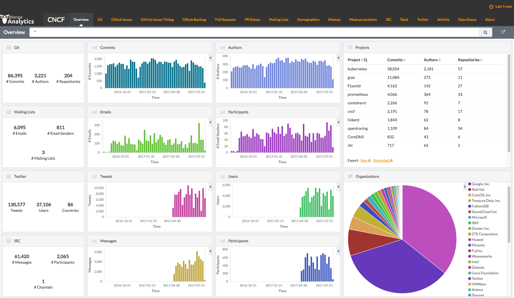
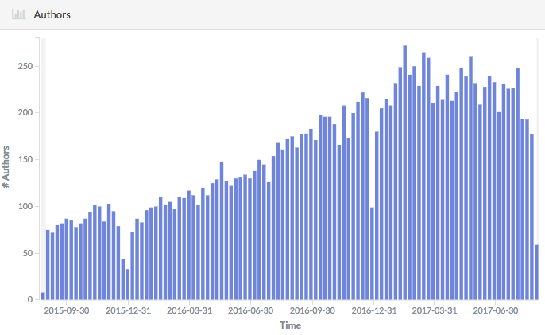
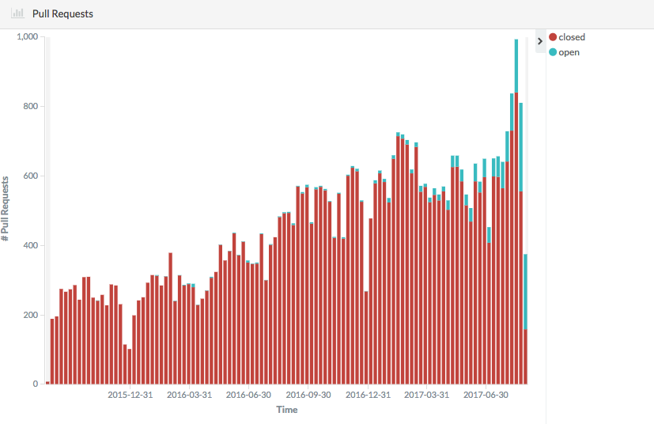
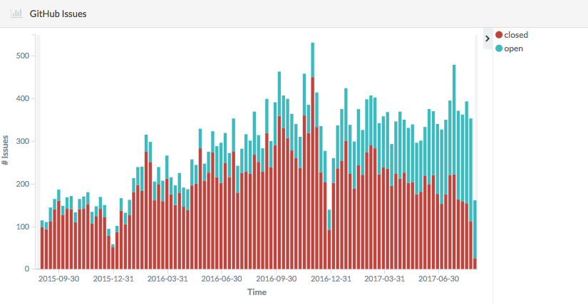

# Measuring Your Open Source Program’s Success

Open source program managers must demonstrate the ROI of their efforts. This guide provides an overview of some of the standard ways that organizations evaluate their open source programs, projects, and contributions.

Learn what to measure, how to define success, and how to best use this information to advance your open source program objectives, demonstrate effectiveness, and gain support.

**Table of Contents**

- [How to define success](#how-to-define-success)
- [Why set goals?](#why-set-goals)
- [How to set goals](#how-to-set-goals)
- [Common goals](#common-goals)
- [What to track](#what-to-track)
- [Other metrics to track](#other-metrics-to-track)
- [Final words](#final-words)
- [Acknowledgements](#acknowledgements)

## How to define success

Smart organizations understand the value of investing in open source development and set goals related to open source use and participation. But every open source program defines success a little differently. The goals you set, and metrics you track, will vary according to the reasons you’re investing in open source – whether it’s to recruit developers, bring in new ideas and technologies through open innovation, achieve faster time to market, lower development costs, or myriad other reasons.

It’s important to set goals according to your unique strategy – and seek buy-in from the executive team to ensure that the open source strategy aligns with the overall business strategy. That said, there are some standard ways that open source program managers measure success, regardless of their industry, product, or business strategy. These include:

* Their developers’ participation and level of influence in external open source projects
* Their organization’s reputation in open source communities
* Their ability to recruit and retain talented developers
* The general health of the organization’s own open source projects and the business-critical projects its developers contribute to
* How well they manage open source license compliance

## Why set goals?

Before we dive into what an open source program tracks and how to do it, let’s talk for a minute about what you can achieve by setting goals and measuring against them.

First and foremost, tracking progress against your goals helps you make sure the open source projects you’re investing in (whether external or internal) remain healthy – that they are answering to the community, representing the company well, and helping to meet the broader goals of the open source program. Regular tracking can help set benchmarks for open source projects and serve as an early warning system that allows for course correction if a project veers off track, falls out of legal compliance, or simply needs to be retired.

Careful (and strategic) measurement also makes great fodder for reports to upper management. Regular reporting helps ensure the program stays on track with its goals and the overall business strategy and helps program managers gain internal support for the program among executive leadership (especially if you’re meeting or exceeding those goals!)

Facebook’s open source program office, for example, periodically posts the month-over-month results from its open source projects internally and sends an executive report to management.

> “Reports are just a good way to raise awareness. Even though Facebook places a high value open source (as an organization), it’s still always a good thing to market yourself internally all the time and show your value.” – [Christine Abernathy](https://twitter.com/abernathyca), Open Source Developer Advocate at Facebook.

Publishing the results publicly on a regular basis also helps raise awareness of your organization’s open source activities among potential partners, users, and developers.

Getting the word out about results – the good, the bad, and the ugly – increases your program’s transparency, accountability, and thus credibility, in open source communities. See example open source report cards from [Facebook](https://code.facebook.com/posts/1058188987642144/facebook-open-source-2016-year-in-review/) and [Google](https://opensource.googleblog.com/2016/10/google-open-source-report-card.html).

## How to set goals

It’s OK to have lofty goals for your open source program, but set reasonable expectations for how you will get there and on what kind of timeline. First, it’s helpful just to start measuring to establish a baseline for performance. Set up the right tools for collecting data and make sure the data sources are clean and in a format you (and your manager) can understand. Many organizations create a dashboard of metrics for their open source programs, to track all of the data in one place and provide project snapshots that can help assess progress at a glance. (See our guide on Tools for Managing Open Source Programs.)

Next, get all of the open source program managers and stakeholders together – at Facebook, this includes the engineering leads and project maintainers – and decide as a group where you want to go over the next 3-6 months (small, achievable increments). At the end of that time period, look back at how you did and adjust goals and tactics for the next pass, based on the previous pass.

> “I tend to find metrics based on what the community is feeling as pain, and try to change those metrics for the better to improve the community health.” – [Sarah Novotny](https://twitter.com/sarahnovotny), Kubernetes Community Manager at Google.

In addition to the baseline performance metrics, here are some more things to consider as you’re setting goals for your program:

* **Strategy alignment:** Do your goals align with core business strategy, product goals, and other internal business goals?
* **Level of control:** Do your program managers have direct control over results, or does that live with engineering, legal, or some other function? Set goals that are achievable, within your control.
* **Project variation:** Goals can and should vary by project, depending on its purpose, community composition, technology stack, and other variables. For example, Facebook has noticed that its Javascript projects tend to be forked more often. They’ve learned (after many cycles of tracking!) these metrics aren’t necessarily the best indicators of project health for this type of project.
* **Quantity vs. quality:** Not all goals should be tied to a number. Process improvements that boost the quality of your projects are just as important, if not more so. Just because you’re hitting all the numbers, doesn’t necessarily mean your projects are healthy. Conversely, a very small project that’s not growing could also be extraordinarily healthy.

“You could have a half-dozen core contributors and a dozen people who are active but not maintainers, but there are healthy discussions, and pull requests are handled in a short manner, and ponderous feature discussions have a clear beginning, middle, and end. That might be an incredibly healthy community, but it’s not going to have the gazillion stars or forks on GitHub, because it may be a niche project,” Novotny says. “So I tend to look at how the community is interacting with itself, how new leadership is being grown and mentored, and how any pain points are evolving.”

## Common goals

When it comes to measuring your open source program’s success, it’s tempting to focus on the quantitative metrics for your projects: total number of contributors, lines of code, number of projects, etc. We’ll discuss what to measure to assess your project health in the next section. But first there are many other important ways to measure your program’s success than strictly by these numbers.

> “I think using metrics as a way to inform the trend is good. Using them as the only method of success leads you to trouble.” – [Joe Beda](https://twitter.com/jbeda), a founding engineer of Kubernetes at Google and Co-founder and CTO at Heptio.

Kubernetes is one of the highest velocity open source projects on GitHub, attracting more than 80,000 commits from 2,760 developers at 1,181 companies over the last three years. But from the start, the project has managed its success in terms of whether its users were excited about the technology and using it, not by “some list of open source metrics,” Beda said.

Below are some of the common goals behind an open source program office, and the top ways that program managers measure against these goals to track the overall progress of the program. Some of these goals can’t be measured, per se, but are about improving processes, efficiencies and quality. Others can be measured by conducting surveys or other methods of assessment such as regularly, and actively soliciting verbal or written feedback. (Talk to your team!)

### Goal 1: Ensure the efficient and legally compliant use of open source code.

This is where organizations typically start when they get involved in open source. They realize engineering is consuming a lot of open source software either in their infrastructure, or in their products and services, or both. A program office helps centralize policies and decision-making around open source consumption, track its use, and ensure the organization doesn’t run afoul of its legal obligations under the various open source licenses. Programs can also keep track of how well they help developers resolve any legal issues they may encounter.

Some of the most common ways to measure against this first goal are aimed at ensuring that policies and processes are working the way they were intended and that the organization remains in legal compliance:

* How much open source code do you consume?
* How well is that consumption tracked?
* The policy for using open source code is clear and developers are aware of it.
* The processes and tools for bringing in code is clear and developers are following it.
* Which products and services are third-party code being used in?
* How many compliance issues are you having and how quickly are they resolved? (You do you have a compliance program, right? See our legal resources from the [Open Compliance Program](https://compliance.linuxfoundation.org/) for more on this topic.)

### Goal 2: Increase developer productivity.

Once you’re tracking and managing your open source use, you’ll want to make it easier for developers to contribute to open source projects. If your engineers have to go through layers of red tape to submit a bug fix or new feature to a project that your business depends on, you’re wasting precious time and resources. Developers also save considerable time over the long run by contributing upstream, rather than maintaining a separate fork of the project which accrues technical debt over time.

> “We try to set ourselves up to be like those people on the marathon route who give water to the runners. We encourage the developers to take a couple of extra steps in our direction knowing that by doing so they actually will get to their goal in the long run. We really try to set up a program to be a support service, not a speed bump.” – [Gil Yehuda](https://twitter.com/gyehuda), Senior Director of Open Source at Oath (Yahoo + AOL)

Metrics related to this goal are aimed at greasing the wheels for developers to contribute back to open source projects, as well as increasing the overall amount of code your organization contributes back upstream. Once you remove barriers to contribution and make the approval process clear and quick, you can expect more contributions and efficiencies. Things to track include:

* Number of commits made to external projects identified as strategic to the organization
* Number of developers contributing. Also, who are they and which projects do they contribute to?
* Number of project maintainers employed by the organization (hired and grown)
* Project health for the projects you contribute to
* Sentiment analysis: your organization’s reputation in open source communities
* Are developers aware of the policy for contributing? (You have one, right?)
* Do they follow the process for contributing? (ie must they sign a CLA, etc.)
* Do they ask you for help and are you prompt in providing it?
* Amount of time between software releases – is it increasing or decreasing?
* What are the engineering costs associated with contributing upstream vs. maintaining forked code?

### Goal 3: Create and grow open source projects.

This is the primary goal of many open source programs at large, engineering-focused organizations such as Facebook,Google, Microsoft, Twitter, and many others. They’re creating hundreds (or even thousands) of open source projects that aim to solve hard technology problems. The goal is to attract outside users and contributors who bring in new ideas and help advance the technology at a faster pace – a concept University of California, Berkeley, professor Henry Chesbrough calls [open innovation](https://hbr.org/2003/07/a-better-way-to-innovate).

> “How do you actually get the smartest people in the world working at your company? Well, you open-source stuff and then you convince them to contribute to your projects!” – [Chris Aniszczyk](https://twitter.com/cra), Executive Director of the Open Container Initiative and COO of the Cloud Native Computing Foundation

The many data points available to measure project health are key to tracking against this goal (see the top 5 in the next section). But there are other considerations as well:

* Is there a clear policy for creating new open source projects and are developers aware of it?
* Is there a clear and easy process for creating new projects and are developers following it?
* How easy is it for outsiders to contribute to your organization’s projects?
* Project maintainers are welcoming and helpful
* Projects are well-maintained and supported
* Code is well documented
* How to contribute is well-defined
* Other quantitative metrics such as number of new contributors, number of issues created, amount of time it takes to close issues, etc. (see the next section)
 * Number and diversity of external contributions your projects receive
 * Popularity of your organization’s projects: GitHub stars, social media followers, etc.
 * Number of users in deployment and/or production
 * Number, breadth, and quality of projects your organization launches. For example, mobile or data infrastructure-related projects, etc.
 * Performance increases in your project and related product
 * Time between releases

> “During one half we decided that we wanted to have more flagship projects that get launched and make it a little bit more of a rigorous process in terms of what we open source. But there were no numbers behind that. It just meant revisiting the process of how open source projects were launched.” – Christine Abernathy, Facebook.

### Goal 4: Recruit and retain developers.

Participating in and creating open source projects as an organization is a great way to attract developers – and onboard them quickly, with fewer resources devoted to training. Developers who use or contribute to your projects will already be familiar with your processes, tools, and technologies when they join the organization. (See our guide on Recruiting Open Source Developers.)

But chances are that you as a program manager will not have a direct role in recruiting developers, and it may not be clear what immediate effect your organization’s open source participation has on hiring. To help make a more direct connection between program efforts and recruiting, Facebook conducts a biannual survey which asks new hires three basic questions:

* Are they aware of the company’s open source program?
* How did that awareness influence their decision to join the company?
* Does their experience with open source apply to the work that they are doing now?

> “We use the survey to measure the health of our open source culture and it speaks to the overall effectiveness of how people view our open source projects. It’s good to know the numbers trend upwards.” – [Christine Abernathy](https://twitter.com/abernathyca), Open Source Developer Advocate at Facebook.

Other common metrics for developer recruitment include:

* Which open source projects employees use and contribute to
* How new recruits heard about the organization
* The number of developers you’re bringing on through open source projects
* How many project maintainers you recruit (and grow)
* How long it takes to onboard new hires
* How open source developers are advancing in their careers
* Developer contributions are assessed as part of job performance
* Developers are recognized and rewarded for contributions
* Developers receive help and support in contributing

### Goal 5: Promote open source culture.

A lot of how open source programs contribute to engineering talent also comes down to cultivating the culture and practice of open source within your organization. That’s because organizations that embrace open source are known as good places for developers to work and innovate. Open source program managers are often ambassadors for an open source ethos within their organizations, as well as overseeing the policies and practices for collaboration.

It’s important to track how open source culture advances within your organization to measure your program’s effectiveness. Some common ways to measure adoption of open source culture include:

* Awareness of and support for the open source strategy and program among management and individual contributors across all departments, from engineering to marketing and public relations
* Branding and awareness in open source communities – how your organization is perceived
* Participation – you are participating actively in open source communities in a positive way.
* Training and mentorship – you work with developers to improve their open source contributions and projects, find opportunities to contribute, and learn the tools and processes of open source communities, ensure that contributors receive support from their peers and managers
* Adoption of a common toolset
* Code quality is acceptable for open source/external consumption
* Advocating on behalf of the organization – attending and speaking at conferences, writing articles or tutorials, etc.
* Sponsoring foundations, groups, or hackathons

### Goal 6: Align open source community interests with product interests.

Community advocacy is a fairly new, but increasingly popular, role in open source programs. You will often act as a liaison between your projects’ developer and adopter communities – representing the voice of external users building on your open source code and funneling information back to the product management team.

This is an important role that ensures your products and services are benefiting from your open source communities,and thus that your open source program stays in line with the organization’s broader business strategy and objectives. Some metrics to track success in your advocacy include:

* How many contributions are coming from outside the organization?
* How many full-time contributors are outside your organization?
* How much externally contributed code is making it back into products?
* How many hires are coming from open source contributions?

## What to track

There are many ways to measure success and track progress for open source programs. Project health isn’t the only thing to track, but it’s still very important. The problem is, there is so much data available around open source projects. Anything you can get data on, you can collect and track. Again, the metrics each organization tracks – and what they do with the data – depends heavily on its own goals for the program, and its unique challenges in the market and in the open source community.

> “We gather the data that we can because that data is available but we don’t live in the numbers. We live in ensuring we have the right outcomes.” – [Gil Yehuda](https://twitter.com/gyehuda), Senior Director of Open Source at Oath (Yahoo + AOL)

For some (crazy or fully automated) program managers the answer is just to track all the things. But for large organizations in particular, there are so many projects it would be impossible to track everything and be able to make any sense out of it. So what are the real indicators of an open source project’s health?

Here are the top metrics for assessing overall project health in your open source program. These are only a starting point for more rigorous and thoughtful analysis. Keep in mind that these are the tips for helping program managers responsible for ensuring the health of multiple projects. The projects themselves should also track their own metrics for health. [GitHub’s guide on open source metrics](https://opensource.guide/metrics/) gives a great overview of what project maintainers should pay attention to.

These numbers are easily collected from GitHub using free and open source tools, as well as commercial offerings. Measure them at regular intervals (monthly, quarterly, and annually) to help benchmark progress for individual projects, as well as rolled up into aggregate counts for the program as a whole. Use them in reports to management, and to help your developers improve your projects.

> “We periodically just try to check and see, are the projects healthy or not, and just give them advice on what they should do better. But we don’t directly manage. We just give them the data and then sort of nudge them when we can, or when we have to.” -[ Christine Abernathy](https://twitter.com/abernathyca), Facebook.

### Number of contributors (and the ratio of external to internal contributions)

Projects start with the majority of contributions coming from internal developers and evolve to include more outside contributions as the source code is used or forked. The healthiest projects that are sustainable over time have extremely diverse communities with the bulk of contributions coming from other companies in the project ecosystem that have taken commercial dependencies on that code. (Remember the 1,000+ companies contributing to Kubernetes?)

Projects that are consistently attracting new external contributors are likely doing a good job maintaining the project, welcoming contributors, and incorporating feedback from the community. (Note: This may still be true for projects that aren’t growing their contributor base!)

### Number of pull requests submitted, open, and accepted (and length of time they remain open)

When a contributor finds a bug or has a feature request that they can (and have clearance to) patch or write themselves, they do so and submit it as a pull request (PR). Tracking the number of pull requests, and what happens with them, demonstrates how much code is being submitted by contributors outside of your employ and is thus an indicator of the level of outside interest in your projects.

The length of time PRs remain open also indicates how responsive and welcoming your project maintainers are to outside contributors. If a PR sits for too long without response, potential contributors may take their good ideas elsewhere.

> “When we have a good project, we probably don’t have a pull request that’s open for more than, I would say, two to three months at most. And that’s actually a lot.” – Christine Abernathy, Facebook.

Keep in mind that these metrics are highly dependent on the size of the project. Facebook’s smaller projects will try to keep the number of open pull requests at 10 or less. But keeping PRs at this limit would be challenging for bigger projects that have a lot of community input compared to the number of maintainers. Reviewing those pull requests takes time so bigger projects tend to have longer open PRs.

Facebook’s open source office frequently runs queries in the database and picks the top five projects with the most open PRs. They pinpoint a few issues and then take the opportunity to open up a dialogue with the project’s maintainers. They ask them a couple of questions to get to the root of the issue and see what might help solve the problem. More often than not, it’s simply a matter of refocusing their attention and reminding them that it’s important to keep the community happy. But occasionally, digging into the numbers points to deeper problems with a project. A lot of open PRs, or old PRs, could mean that only one or two people are maintaining the project – a potential red flag.

### Number of issues submitted (and length of time they remain open)

Users who do not have the time, permission, or ability to submit a pull request, but encounter problems with your code can submit their bugs and feature requests as an issue. The number of issues, and how they are addressed, can indicate your projects’ levels of user adoption as well as how responsive maintainers are to user needs.

This number depends, of course on how issues are tracked. For a project that’s only using GitHub to track bugs, issues are probably going to stay open for a much shorter time than a project that’s using GitHub for issues that includes feature requests. These considerations drag down, or drag up, the issue age.

### Number of commits per contributor (external vs. internal)

The number of external commits a project has relative to the total is another indication of how effective the project is at innovating in the open – bringing in new ideas from the outside. Healthy projects will see the ratio of external contributors increase over time. Measuring the number of commits per contributor also helps to assess whether your projects are attracting new contributors and if those new contributors stick around.

### Number of external adopters

Each open source project should have a way to track organizations that opt to adopt the software in a production environment. Whether it’s through an ADOPTERS.md file or a simple list in the README, the key thing is to track this list and ensure it grows over time. If the number of external adopters stops growing or shrinks, it can signal everything from project maturity to project obsolescence.

### Number of projects created or contributed to (program-wide)

Track these metrics for each project your organization releases, but also the projects your developers are actively contributing to. In the process of creating your open source strategy, you should have identified the business-critical projects your organization is using and earmarked some investment for contributing to those projects. It’s important to measure your organization’s open source success not only by the health of your own open source projects but by its open source activity as a whole. This includes the health of the projects you rely on for product development and business operations, as well as ensuring your organization is legally compliant with the open source licenses of any projects you do use or release. (See our [Open Compliance Program publications](https://compliance.linuxfoundation.org/references/compliance-related-publications).)

## Other metrics to track

The basic project metrics are a good starting point to get your thumb on the pulse of your open source contributions. But successful program managers require a deeper dive into other important metrics.

Here are a multitude of other things you can and maybe should be tracking, depending on your goals. Remember that the number itself isn’t the goal – it’s the process of tracking them over time and finding patterns in the data that can inform project and process improvements. Measure for each project, and across projects for a comprehensive view of your program’s output and results.

* Popularity/awareness
 * Visitors to the project website
 * Total number of followers on GitHub/GitLab
 * Number of followers on social media accounts such as Twitter, Facebook, or LinkedIn
 * News clips and media mentions
 * Number of meetups organized and hosted (e.g., via meetup.com)
* Influence
 * Number of employees in a maintainer/leadership role in your strategic projects
* Diversity of contributors to your projects
* Patches rejected, and why
* Adoption
 * Number of downloads
 * Number of forks created
 * Number of contributing external companies
 * Stages of adoption (# of deployments in PoC and production)
 * Number and quality of commercial dependencies (products) – This can be tracked by looking at the companies contributing to your projects, as well as following the news and trade press.
* Program costs
 * Staff: engineering, PR & marketing, legal
 * Infrastructure and support
 * Tools
 * Conference attendance and travel
 * Training
 * Memberships and donations

## Final words

Organizations evaluate their open source programs, projects, and contributions in whatever way makes the most sense for their needs. The most important thing to remember is to set a strategy and incremental goals to achieve it. What you track, and how, will naturally follow.

## Acknowledgements

Contributors:
* [Christine Abernathy](https://twitter.com/abernathyca), Open Source Developer Advocate at Facebook.
* [Chris Aniszczyk](https://twitter.com/cra), COO of the Cloud Native Computing Foundation.
* [Joe Beda](https://twitter.com/jbeda), Founding Engineer of Kubernetes at Google and Co-founder and CTO at Heptio.
* [Sarah Novotny](https://twitter.com/sarahnovotny), Kubernetes Community Manager at Google.
* [Gil Yehuda](https://www.linkedin.com/in/gilyehuda/), Senior Director of Open Source at Oath (Yahoo + AOL)

*These resources were created in partnership with the TODO (Talk Openly, Develop Openly) Group – the professional open source program networking group at The Linux Foundation. A special thanks goes out to the open source program managers who contributed their time and knowledge to making these comprehensive guides. Participating companies include Autodesk, Comcast, Dropbox, Facebook, Google, Intel, Microsoft, Netflix, Oath (Yahoo + AOL), Red Hat, Salesforce, Samsung and VMware. To learn more, visit: [todogroup.org](http://todogroup.org/)*
