# Open Source Reading List

21 Must-read books for open source program managers, recommended by members of the [TODO Group](http://todogroup.org/) community.

[New Frontiers in Open Innovation](https://www.amazon.com/Frontiers-Open-Innovation-Henry-Chesbrough/dp/0198803990/ref=sr_1_cc_1?s=aps&ie=UTF8&qid=1507753139&sr=1-1-catcorr&keywords=New+Frontiers+in+open+innovation), OUP Oxford, by Henry William Chesbrough (2014)

An overview of research findings on open innovation in the enterprise.

[The Open Organization: Igniting Passion and Performance](https://hbr.org/product/the-open-organization-igniting-passion-and-performance/13980-HBK-ENG), Harvard Business Review Press, by Jim Whitehurst (2015)

Red Hat’s guide on how to structure and manage an organization that’s open source to the core, from the world’s first billion-dollar open source company.

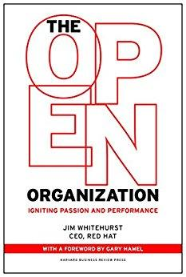

[The Open Organization book series from Opensource.com](https://opensource.com/open-organization/resources/book-series)

The open organization community turns Jim Whitehurst’s _The Open Organization_ into a book series, with installments including _The Open Organization Leaders Manual_, _The Open Organization Guide to IT Culture Change_, and _The Open Organization Workbook_.

[Open Innovation: The New Imperative for Creating And Profiting from Technology](https://www.amazon.com/Open-Innovation-Imperative-Profiting-Technology/dp/1422102831), Harvard Business School Press, by Henry Chesbrough (2005)

A foundational work that takes an academic view of how and why IT companies have effectively innovated through collaboration.

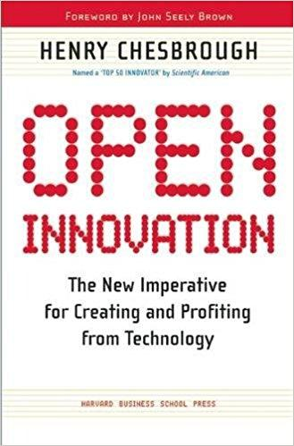

[Open Business Models: How to Thrive in the New Innovation Landscape](https://hbr.org/product/open-business-models-how-to-thrive-in-the-new-inno/an/4273-HBK-ENG), Harvard Business School Press, by Henry Chesbrough (2006)

Builds on Chesbrough’s previous work and reads as a guide to making money through open innovation.

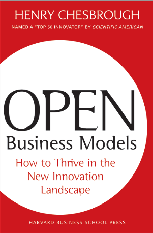

[Wikinomics: How Mass Collaboration Changes Everything](https://www.amazon.com/dp/B000QBYEH8/ref=dp-kindle-redirect?_encoding=UTF8&btkr=1), by Don Tapscott and Anthony D. Williams, (2006)

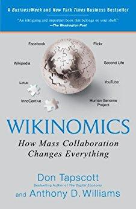

[The Cathedral and the Bazaar](http://shop.oreilly.com/product/9780596001087.do): Musings on Linux and Open Source by an Accidental Revolutionary, O’Reilly Media, by Eric Raymond (1999)

A seminal work that defined the open source movement and its role in the enterprise.

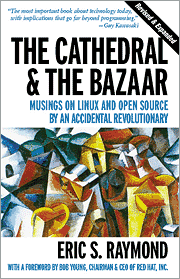

[The Magic Cauldron](http://www.catb.org/esr/writings/magic-cauldron/) by Eric Raymond (1999)

A free essay from The Cathedral & The Bazaar on the economics of open source.

[Philosophy of the GNU Project](https://www.gnu.org/philosophy/philosophy.html), by Richard Stallman

Whether you agree or disagree, it’s helpful to understand Stallman’s perspective.

[Producing Open Source Software](http://producingoss.com/en/index.html): How to Run a Successful Free Software Project, O’Reilly Media, by Karl Fogel (2005)

A guide to how successful projects operate, the expectations of users and developers, and the culture of free software.

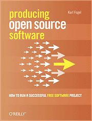

[Open Sources 2.0](http://shop.oreilly.com/product/9780596008024.do): The Continuing Evolution, O’Reilly Media, by Chris DiBona, Mark Stone, Danese Cooper

A collection of essays on the impact open source has on diverse industries, from an experienced group of enterprise open source managers and advocates.

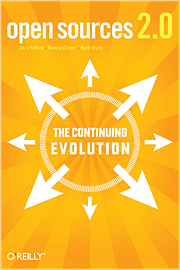

[The New Kingmakers](https://www.amazon.com/New-Kingmakers-Developers-Conquered-World-ebook/dp/B0097E4MEU), O’Reilly Media, by Stephen O'Grady (2013)

Read this if you want to understand the role of developers in technology decision-making today.

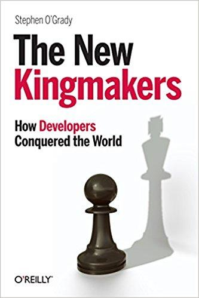

[The Software Paradox](https://www.amazon.com/Software-Paradox-Rise-Commercial-Market/dp/1491900938), O’Reilly Media, by Stephen O’Grady (2015)

Learn why the commercial software market has changed from a RedMonk analyst.

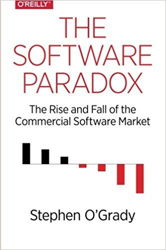

[The Art of Community: Building the New Age of Participation](https://www.amazon.com/Art-Community-Building-New-Participation/dp/1449312063), O’Reilly Media, by Jono Bacon (2012)

An essential guide to creating and working with open source communities from former Ubuntu community manager Jono Bacon.

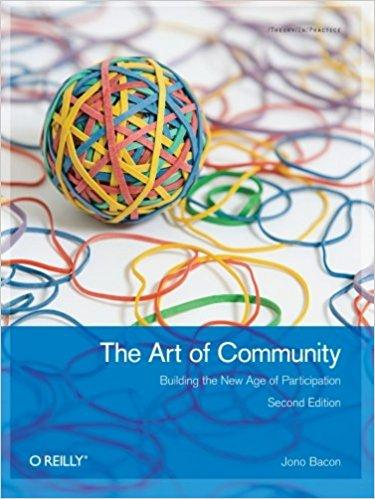

[Open Sources: Voices from the Open Source Revolution](http://www.oreilly.com/openbook/opensources/book/index.html), O’Reilly Media, by Eric S. Raymond (1999)

A free collection of essays from some of the early leaders in open source.

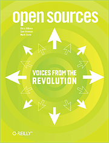

[Codev2](http://codev2.cc/), by Larry Lessig (2005)[ http://codev2.cc/](http://codev2.cc/)

A classic treatise on Internet regulation and the role of code as a form of law.

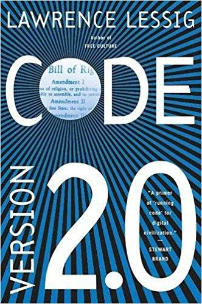

[Open Source for Business: A Practical Guide to Open Source Software Licensing, 2nd Edition](http://www.pdffull.co/files/book.php?id=1544737645) by Heather Meeker

Read this to understand open source software licensing.

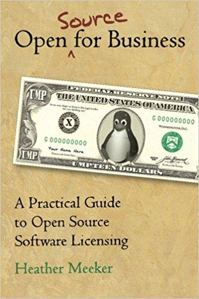

[The Open Source Alternative](https://www.amazon.com/Open-Source-Alternative-Understanding-Opportunities/dp/0470194952/ref=pd_sim_14_2?_encoding=UTF8&psc=1&refRID=TRNY5HWZJ8WXZJFPW2A1), Wiley, by Heather Meeker (2008)

A user manual for understanding open source licensing issues in business.

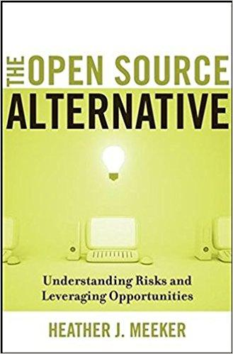

[“The Success of Open Source”](https://www.amazon.com/dp/B002OSXS0U/ref=dp-kindle-redirect?_encoding=UTF8&btkr=1), by Steven Weber

Great for understanding the significance of open source from an outsider’s perspective.

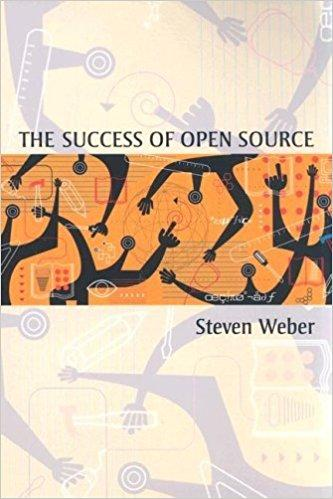

[http://www.amazon.com/Intellectual-Property-Open-Source-Protecting/dp/0596517963](http://www.amazon.com/Intellectual-Property-Open-Source-Protecting/dp/0596517963) – Intellectual Property and Open Source, by Van Lindberg

A book on open source licensing from an engineer’s rather than a lawyer’s perspective that includes a little history of the relevant laws. Why do we have trademarks? Why do we have copyright? Etc.

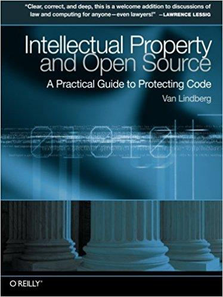

[Managing 3rd-Party Software Licenses,](https://www.amazon.com/Managing-3rd-Party-Software-Licences-ebook/dp/B01JJC7LD8) Self-published, by Giles Middleton (2016)

A quick read that covers a lot of ground.

[The International Free and Open Source Software Law Book](http://ifosslawbook.org/), Open Source Press, by Ywein Van den Brande, Shane Coughlan, and Till Jaeger (2014)

A free and fascinating read on how different countries’ laws affect open source licences by preeminent attorneys in FOSS law.

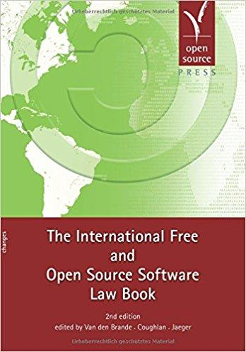
