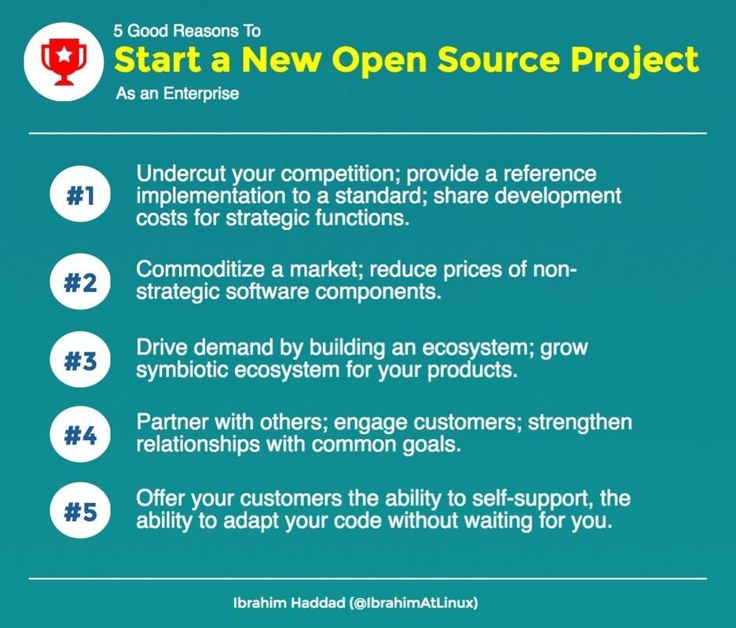
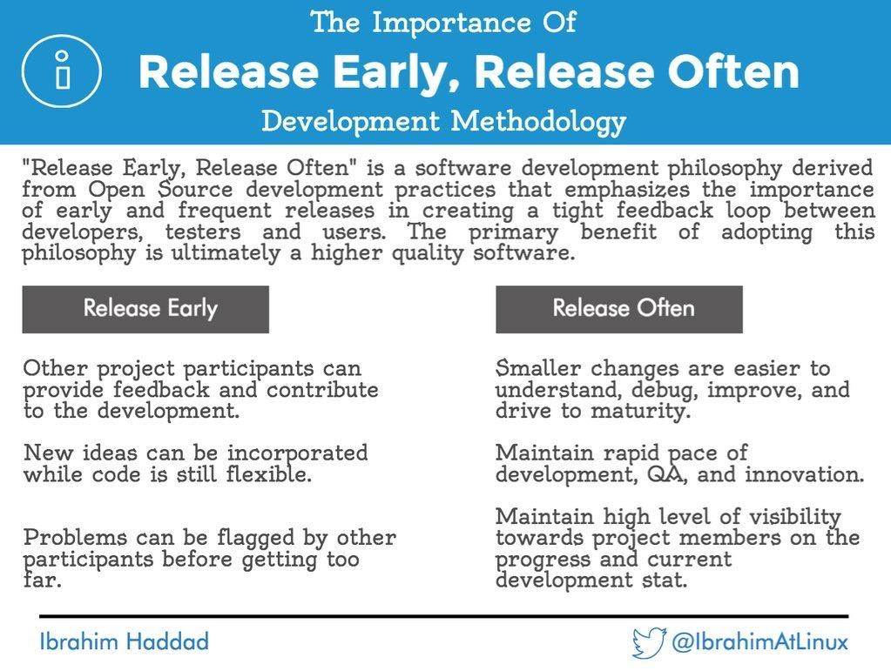
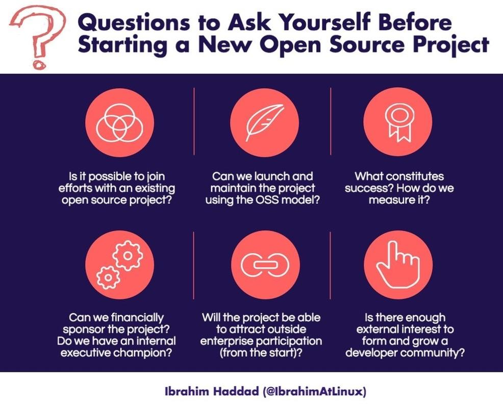

# Starting an Open Source Project

Once a company has participated in open source communities long enough to build a reputation, it’s in a position to launch its own open source projects. It’s at this stage of open source participation that companies can realize the greatest benefits from open collaboration. You can open source proprietary projects that could be of use to the community. Another common avenue is to create new open source projects from scratch and benefit from collaboration among external developers at the outset.

This guide was created to help enterprises already well versed in open source learn what they need to know to start their own open source projects. We’ll take you through the process, from deciding on what to open source, to budget and legal considerations, and more. The road to creating an open source project may be foreign, but major enterprises including Google, IBM, Facebook, Twitter and Microsoft have blazed the trail for you. Follow this guide for topical and helpful advice and you will be on your way.

## Why create an open source project?

There are plenty of reasons for your company to start an open source project. You might aim to innovate faster, achieve quicker time to market, collect new ideas, enable interoperability or de facto standards recruit talented developers, and gather diverse viewpoints and contributions to produce better code and better products.

These benefits can all be realized by using and contributing to open source projects created and managed outside your company. But a comprehensive open source strategy often includes creating and launching your own open source projects as well.

Initiating projects or releasing existing projects as open source to the community strengthens the sense of give and take, which can further build a company’s reputation in open source, and make the company even more attractive to open source developers and more influential in the open source projects where it contributes. Having your codebase as a starting point for discussion can bring other advantages as you look to engage an external ecosystem of partners, vendors and users.

By opening up your own code and development practices to outside use and contribution, you are truly embracing open innovation and using open source to its best effect for your business. Code released under an open source license allows anyone to contribute, inspect, modify, and improve it. This collaborative approach to development is now the de facto way of building software and a proven engine of technological innovation.

This is true whether your primary mission is financial services, providing health care, operating fleets of trucks, selling retail goods in stores or online, providing transportation to commuters and airline passengers, building roads and bridges, or thousands of other specialties. While these enterprises certainly want to keep the applications and technologies that are core to the value they provide to their customers, there exists a myriad of code and software that are dependencies and which are not a high value differentiator to the organization. Opening these technologies up as a project to outside contributions can create new possibilities and opportunities for growing and strengthening this code.

> “No matter how many smart people we hire inside the company, there’s always smarter people on the outside. We find it is worth it to us to open source and share our code with the outside world in exchange for getting some great advice from people on the outside who have expertise and are willing to share back with us.” – Jared Smith, Open Source Community Manager, Capital One

Companies look to open source when they want to move their agendas forward in areas where they might not have the needed talent on staff. By moving to open source, they can often speed up their efforts and work with others who are working toward the same software goals, while also cutting costs and improving their end products.

Open source projects provide freedom to collaborate – even among competitors in the same industry – and can accelerate development by placing many eyes on the code in progress. By working together, developers can share openly, gain plenty of feedback, and together build code that is scalable, efficient, and high quality.

## When to create an open source project

The decision to release or create a new open source project depends on your circumstances. Your company should first achieve a certain level of open source mastery by using open source software and contributing to existing projects. This is because consuming can teach you how to leverage external projects and developers to build your products. And participation can bring more fluency in the conventions and culture of open source communities. (See our guides on [Using Open Source Code](https://www.linuxfoundation.org/using-open-source-code/) and [Participating in Open Source Communities](https://www.linuxfoundation.org/participating-open-source-communities/)) But once you have achieved open source fluency, the best time to start launching your own open source projects is simply “early” and “often.”

## Where to start

Perhaps the time to create a new project is when you realize that you have a tough technical problem which you can’t solve on your own. Another motivator is when you’re unable to find and join another project that does what you want it to do. Ultimately, there is no right answer to the question. You start one when you need one and can’t find an existing effort.

For enterprises considering a new open source project, you want to start by finding your unique answer to “why?” Begin by asking a lot of questions about what is important to your organization. It’s important to start an open source project for the right reasons.

> “I think it is a crucial thing for a company to be thinking about what they're hoping to achieve with a new open source project. They must think about the value of it to the community and developers out there and what outcomes they're hoping to get out of it. And then they must understand all the pieces they must have in place to do this the right way, including legal, governance, infrastructure and a starting community. Those are the things I always stress the most when you're putting an open source project out there.” – John Mertic, Director of Program Management at The Linux Foundation

The place to start includes secondary coding projects where an enterprise does not need to be an authority, and where there may be a larger group of technologists around the world who can help you solve a problem. If it is not mission-critical code, then it is likely a good candidate to be open sourced. However, it should also be code that your company is still actively using and maintaining. Commercial dependencies on code enable a continuous feedback loop of bug fixes, patches and new features.

> “Many of the projects we share are the projects we are using internally, so we try to share what we actually use in production. That means because of Facebook’s scale, it’s battle-tested at scale; it’s professional grade work we’re contributing to the community. The other key thing is that because we are using these tools, we're not going to let them languish and be unsupported because our engineers need them to be robust as well.” – Christine Abernathy, Open Source Team Developer Advocate at Facebook

Another issue to consider is whether your project is unique or if others are already working on similar code because they have similar problems. Is the potential open source project something that’s important for your company to offer and manage as a project and will other users seek it as well? If so, then perhaps the idea makes a lot of sense.

You will also need to decide whether you want to donate your code to a vendor-neutral, non-profit organization or retain some control by owning and running your own project. Again, the answer depends on what you are trying to achieve.

> “Do an open source project because you recognize there are things within a potential project that are not strictly important to your company, but which you want to maintain some control. Do it when you know that by getting other developers involved with it as an open source project that it helps your ship rise as well. So, think of something to pursue and do it.” – John Mertic, Director of Program Management at The Linux Foundation

## Planning the project

Once you've set your plans in motion, there are a myriad of details which must be considered and resolved to bring your open source project to fruition. Let’s take the considerations step by step, starting with how you decide whether to release or donate the project’s source code.

### Decide what code to release or donate

First, you must decide if your company wants to create or release the code while maintaining ownership of it and the project, or if you want to donate the code to others to maintain and administer the project. If the code already exists, then there is the related issue of whether you will release all the code in a project or just some of it as an open source project.

To make these decisions, consider stepping back to determine the objectives you have in mind for the code.

> “When our engineers decide they want to open source a project, we look at several things. First, we want to make sure, is the project going to be useful to developers outside the company? And is the project going to be something transformative? Is it something we can showcase? And is there going to be a community built around this that the person maintaining it will be able to support?” – Christine Abernathy, Open Source Team Developer Advocate at Facebook

For example, you might want to attract fresh insights from other developers on a part of an application that isn’t core to your work. Or you might seek additional real-life algorithms to detect logs in a system monitoring application. Rather than releasing the whole product as open source, you could release only the code related to the algorithms. This allows you to gain the contributions of others and help others who are needing similar help, without compromising your core business.

Starting a project and maintaining overall control lets you have oversight and gives you the ability to help shape it into what you need, while still giving freedom and control to the contributing developers to do their work.

Contributing your code is different. It means giving it up and handing off some control to others to maintain and administer. It may be code that is no longer needed by your company, but it still has value to others because it fills important niches for users. Such code, which your company simply may not have time for anymore, can be welcomed and furthered by open source communities and can lead to thriving long-term projects. It may also be critical code for your company, but a project needs a neutral home in order to attract more participants and grow a broader ecosystem.

Do not just contribute code that is no longer useful or of interest to you and expect a community will keep it up to date – that’s not what we mean. On the contrary, never use open source communities or projects to dump old code to see if it gains traction. If it’s not really an important project, you're going to lose credibility in the world of open source and when you later try to open source other code, developers won’t be interested. They’ll remember that you wasted their time in the past, which is not something you want to have happen.

> “If you create three open source projects this year and they're all really good and they've attracted a good community and there’s lots of value in them, that’s much more important than creating 10 open source projects a year. Honestly, the open source community values quality over quantity and they will self-select which projects to join. If you create 10 that are horrible, you're not going to create any traction. You want to open source good stuff.” – Guy Martin, Director of Open at Autodesk

### Build a business case

It’s also a good time to start an open source project after you have developed a sound business case that’s bolstered with outcomes that can be achieved, like any other product you're bringing to market. Then there is the needed executive buy-in as well, because management needs to understand why it is being undertaken, what the goals and budgets are, what the roadmap is going to be, what intellectual property will be opened up, and what code will and will not be involved.

### Allocate resources

You’ll also need to decide whether you can make the necessary resource commitments, including developer time to be contributed to the project. Developer time will likely be similar initially to the amount of time they spend on internal code efforts. You’ll also need to consider what time, materials or help your developers will need to provide to help others in the new community get up to speed on the codebase. There will also be resources needed for the legal team that will be involved in creating an open source project that could involve competitors. And marketing investments will ensure that the project gains support and contributors after launch.

You’ll also have to set budgets for the infrastructure used to begin and maintain the project. This includes a project hosting and source control website like GitHub, where the code will reside and be maintained, as well as bug resolution, and other needed tools.

### Test the code quality

The readiness and maturity of the code you are considering for use in your open source project can also be an indicator that you are ready to start your planning. You want to ensure that the code is in good shape, and as we mentioned earlier, not junk code that will lead to a credibility disaster with the open source community.

At the same time, the trap you must be careful of is that perfect code isn’t required. If you think that the code has to be perfect, you’ll likely never get it started. Go with the best you've got and know others will be helping to make it better. You do also want to be sure that the code you start with doesn’t include code comments with trade secrets, references to your proprietary interfaces or profanities and other issues as you ensure it is mature enough to get out there into the community.

### Make sure it’s useful

Your project is also ready to move forward when you can see and demonstrate that it will be useful to others as well who are seeking such answers to their IT problems, which can be gleaned through traditional market analysis. You want to be sure that it’s something that others will seek out and be willing to contribute to so it can be a successful project. Do some research and ask around. Attend open source events and talk to developers and presenters about their problems and projects.

If you find that others have already started a similar project to solve a similar problem, then you can consider whether you want to join that effort rather than duplicate it. If a similar project already exists, it’s more powerful to team up, even if your competitor is driving it because collaboration is a critical part of open source communities.

Working with competitors on open source projects is important to consider. If your company starts an open source project and draws in competitors to get involved, you can build collaboration and goodwill, all for the greater good of the code, while leading instead of following.

### Consult your team

Through every consideration we’ve listed, the technical team can work with the executive team to make these decisions and help guide the process to make it successful. Your developers and IT staff can illustrate where and when it becomes useful to collaborate.

> “We’ll start an open source project if we can’t find something we are looking for, or if the thing that we found that has worked in the past doesn’t work for us as we're moving forward. Sometimes that’s for performance reasons. Sometimes that’s simply cost reasons or vendor lock-in reasons. Sometimes it’s simply we're moving a bunch of our infrastructure over to more modern technologies and some of the legacy vendors we've used in the past just aren’t prepared or aren’t willing to run their software in a cloud or containerized environment.” – Jared Smith, Open Source Community Manager, Capital One

## Launching your open source project

Once you’ve properly planned your project, it’s time to take some more formal steps to set up your project, starting with legal preparations. This includes code scanning and scrubbing to ensure the code is safe to use, choosing the right open source license for your project, and setting project governance for smooth operations. Related topics to tackle include: setting up the proper infrastructure, preparing the code to get started, and then finally communicating the launch to the community and providing ongoing documentation.

### Legal review

One of the worst things that can happen to a project is for the community to have distrust in the legal cleanliness of a codebase. It’s important to ensure the code you release has clear licensing and provenance. A full legal review is often helpful in making sure what gets contributed will be acceptable by others in the community. A key aspect of this review is verifying that your company has the right to release all of the code. Your legal review should include trademark due diligence and registration. Note that if you are contributing the project into a foundation, make sure you’re aligned on the trademark strategy before open sourcing your codebase.

You’ll also need to choose a license for your project. It’s important to document any licensing or intellectual property requirements. An IP Policy can be a helpful document to create to make all licensing and contribution requirements clear. Also make sure your code has license headers or SPDX license identifiers embedded in each file. Another best practice is to require a Developer Certificate of Origin (DCO) ‘Signed-off-by’ on each commit to help improve the provenance of the code. GitHub for example has built a tool for requiring this in any repository, available at https://probot.github.io/apps/dco.

It’s important to be familiar with the common open source licenses and their tradeoffs. Some have explicit patent grants, some have defensive termination rights, some protect the rights of users, some offer cure provisions and some are just simpler or more commonly accepted in your industry. You also need to consider the licenses that are in use for your dependencies and other codebases your software may be combined with or integrate with.

In addition to the software source code, consider the license requirements for other aspects of your project. If you anticipate needing corporate commitments for patent grants, or the ability to relicense the project later, you may want to look at some of the more common Contributor License Agreements (commonly referred to as CLAs). Not all CLAs are alike, so consider this option carefully. Also be aware that CLAs can be an impediment to participation as developers often have to go through arduous approval processes to get them signed.

Your project may also produce deliverables that are not software. If your project is producing documentation, discuss whether you should use a specific license for the documentation. For example, many open source projects will use an open source license for the software and a Creative Commons license for the documentation. Additionally, some projects seek to create specifications that may be implemented in various ways by others. Those projects should consider the option to use a specification license. One example of this would be the [Open Container Initiative (OCI)](https://www.opencontainers.org/) which uses the OWFa 1.0 – Patent Only specification license for the specifications and the Apache License, Version 2.0 on the open source software implementation they’re building.

Another common consideration in licensing is choosing between copyleft and permissive licenses. Copyleft is commonly used to describe licenses that require reciprocal sharing and in general try to guarantee the rights of users to receive the source code for the software they’re provided. Permissive licenses tend to favor making it easy for others to participate and share contributions without downstream obligations. This particularly favors software segments that require the ability for software producers to distribute proprietary software based on the open source codebase without revealing their changes.

Each licensing approach has its advantages and disadvantages, but be aware of the potential for fragmenting your project, which is a particular problem for software that needs to be interoperable or provide portability across various vendor solutions. Often this issue is addressed by creating conformance programs that permit usage of the project trademark if the commercial solutions pass a community created test or set of requirements. Thinking about this up front will help inform your legal review and plans for the project. (For more extensive reading on open source legal issues and considerations, see our recommended [Reading List](https://www.linuxfoundation.org/open-source-guides-reading-list/).)

In summary, the steps in the legal review process include:

* Consider the impact of open sourcing on your company’s intellectual property
* Ensure full compliance with open source licenses
* Select an open source license for the source code to be released, document all licensing requirements very clearly i your project
* Decide if you need a contributor agreement
* Consider the possible non-software outputs from the community and the appropriate licenses, such as documentation and specifications
* Decide on any trademark related considerations
* Decide whether there are additional factors to build into your plans for an ecosystem, such as conformance testing

### Technical review

The technical review verifies that the source code can function without dependencies on other internal code or development practices, and that it does not include third-party code the company cannot include in the open source release.

You’ll want to ensure that no portion of the code you plan to release violates intellectual property of another company, such as patents. There are plenty of patent trolls out there who will go after code that violates patents held by others. This is a huge issue with major negative implications and you must get it right from the start. To do this companies often scan the code with specialized scanning tools to ensure it is clean. Add license and copyright notices, as well as documentation describing what it is and how it can be used.

The technical review should include verification of all license and copyright notices, and private code comments should be scrubbed. Steps include:

* Remove critical dependencies on non-public components
* Provide documentation and use case examples
* Remove internal comments, references to other internal code, etc.
* Ensure coding style is consistent
* Update copyright notices in source code files
* Add license notice in source code files
* Add license text as a file in the root directory

### Governance

To ready a project for launch, you also must define the technical requirements for project governance. Governance is the process by which the project makes decisions regarding strategy, releases, direction, and development priorities. Decision making should be public and open, to help ensure that all participants are aware of changes to the project and to maintain transparency. Also consider if your governance should include paths for escalating issues.

It’s important to decide early in the process what criteria must be met to participate in the project

governance body. Decisions should be formalized on how features and bugs will be tracked, how code will be submitted, and who will manage the release process.

You want to make sure the people entrusted with the project have the tools they need to operate and maintain the project. This is where your [open source program office and manager](https://www.linuxfoundation.org/creating-an-open-source-program/) comes in.

> “You need to make sure the people that need to get these things done are well empowered to be successful. You also need to be conscious of not intermixing the business half of the project with the technical half of the project – they need to have distinct leadership. That way you don’t get things stuck in the tracks. You're not getting people making out-of-context decisions. Let the business unit help make the technical unit more successful.” – John Mertic, Director of Program Management at The Linux Foundation

### Technical processes

Prior to a launch it is often helpful to create a standard release process to schedule regular releases of the code as changes and improvements are made by the project maintainers. A schedule should be set up with well-defined and visible details for the development community and the business side of the project.

How often those releases should be made depends on your community’s expectations. If the project is enterprise-focused and you're trying to build something that is very hardened, your release schedule might be twice a year. If the project is smaller in scope and more agile and you are trying to get pieces of it out there, perhaps you might be releasing the code monthly or weekly. The key to the schedule is that the community must dictate the timeline and understand its ability to support the project from a velocity standpoint, while giving users what they need and expect.

If the community provides feedback that the releases are coming too soon or too slowly, then you need to look at the process and make some adjustments. The big thing here is consistency, predictability, and visibility.

### Leadership

Setting leadership roles is also important before getting underway. That can mean different things for different projects. If you are starting a multi-company project with several enterprise participants, the project may need more formal governance, such as a governing board or other management group. Other arrangements could simply require a technical committee that oversees all facets of the open source project from a technical perspective. The composition of the committee would include mostly technical leadership, as well as a liaison back to the executive team to provide updates about progress and project needs. The legal team can then be brought in as the technical members and executives see fit.

Your top architectural minds will also certainly be there, as well as others who know how the code base will work. Altogether, the members of the committee will have a vision for where the project is going as well as support from within the developer community. Those are the people you want there at the table to plan the process.

> “You have a fiduciary responsibility to your organization that is contributing this code, to make sure this is in line with your board of directors and your shareholders and all of that who are entrusted for this IP. You have to be sure they're in alignment with this. But then you have to think of potential liabilities, risks, and pieces like that that open yourself up to problems. **Don’t take this** lightly.” – John Mertic, Director of Program Management at The Linux Foundation

### Infrastructure

Before the launch can ever happen, you need to prepare a repository for the project. This is essentially the infrastructure for a code repository where the project will be available to contributors all the time. Many projects use the well-known [GitHub](https://github.com/) or [GitLab](https://about.gitlab.com/) repositories, or host their own repositories with tools such as Gerrit. There are many other options available as well, but remember it’s often useful to consider making it simple for developers to participate and engage in your project. Choose your platform, open an account, and prepare a place for the code, setup workflows and get ready for the magic to happen.

Bug, issue, and feature tracking also should be included as part of a project’s infrastructure plans. You want to provide an easy place for contributors to make reports of problems that need to be fixed as well as requests for new features that might be useful added. Then there are automated build and test system processes which may need to be included as part of your project’s GitHub repository to keep your systems and project flowing smoothly, while scanning and checking the code to ensure its quality.

### Website

The next step is creating a company-neutral web presence or wiki page for the project. The webpage provides a place for the community to find information about the project including documentation, links to download the code, and more. The webpage can also provide details about the project’s leadership, scope, users and contributors, budget, governance, and other details.

### Communication

Offering communication channels for your community to ask questions for help is critical. You’ll want to find tools that can be integrated into the entire development workflow (for example, receiving notifications for support requests, code check-ins, error logs, and other tasks). You’ll also want to provide critical discussion forums and a mechanism for community members to get quick answers from others who are also working on a project. All are important means of communication that help move projects forward in real-time.

One project tool to consider is [Slack](https://slack.com/), an online team project management and communications platform where users can access and share messages and files, organize workflows, perform searches for information, and more. However, Slack is a proprietary tool and can cost money to maintain. There are other open source options out there such as IRC, [Gitter.im](https://gitter.im/) and others. For example, the Hyperledger project uses a communication system called [Rocket.Chat](https://rocket.chat/) which is fully open source and provides similar features to Slack. If you need modern forums, [Discourse](https://www.discourse.org/) is a great option that is fully open source and also provides optional hosting.

When choosing a communication system, be mindful about any form of lock-in, financial costs, and how easy it is to migrate to a new system in the future. As your community grows, you need to be able to adapt to any new communication channels out there, it wasn’t so long ago that newsgroups were the preferred communication style for a lot of open source projects.

> “Some 190 of our various open source projects are arranged in one central spot in an Autodesk section on GitHub. We used to have at least 14 different sections that focused on Autodesk open source projects. By using some code from Twitter, we brought the 14 sections into a single view where they can be seen by visitors. It’s important from a company perspective to make sure people see what you've launched and that there’s a central place they can go to find it and ask questions.” - Guy Martin, Director of Open at Autodesk

### Launch and maintain

Eventually, after all the planning, preparations and multi-faceted reviews and steps along the path, you’ll be ready to launch and begin to maintain your open source project. You’ll get there through public planning, open communications and the completion of your top to bottom infrastructure, along with the steps you created for governance, technical processes, and everything in between.

Once these critical parts are all in place, it is time to open it to the world and gain input from contributors. When interested contributors inspect the project and see it is thoughtful, concise, and valuable, they’ll be excited to participate out of the gate because it’s something they can use.

Essential tasks prior to launch:

* Pre-brief launch partners
* Ensure that all project infrastructure is running, secure, and scalable
* Ensure developers join and monitor communication channels (IRC, mailing lists, etc.)
* Release source code
* Follow the open source development model

### Don’t forget marketing!

Of course, the launch doesn’t mean the end of your work. To keep the project moving along, there are a series of additional business and marketing steps that need attention as well. They include promoting the project, laying out a successful operational strategy, providing a realistic budget and project branding, as well as establishing lively social media accounts and useful domain names to bolster its long-term success.

A marketing review establishes guidelines for branding. This is particularly important, as it helps to ensure a consistent message in the market. Steps in the marketing review include:

* Design a project logo, color scheme, website, collateral, etc.
* Formalize branding guidelines
* Register social media accounts for the project (Twitter, Facebook, LinkedIn, etc.)
* Register domain names for the project

Now that you have the project, it’s your job to promote it and let people know it’s out there so they can use it and work on it. As a marketer, it’s a fun challenge because your litmus test for success here is how many people you can drive to the project to join in to contribute code, participate in forums, offer bug fixes and report issues.

> “Since the community is essential to this, you want to make sure that you are taking care of the community. This can manifest itself in small things like acting quickly on requests and making sure your projects are helping. So, when someone comes to your project they can look at it and know how it’s doing.” – Christine Abernathy, Open Source Team Developer Advocate at Facebook

### Build the community

After the project has launched, it is essential to monitor the vitality of the external community.

Community building does not happen automatically. In the early stages of the project, it may be

necessary to host developer events or sponsor meetups at major conferences to build momentum.

It’s also extremely important to manage expectations and fulfill obligations for project governance and transparency.

Ongoing activities include:

* Designate a community manager or community advocate
* Ensure any changes to direction or governance are clearly communicate
* Follow best practices of other similar communities
* Encourage and provide opportunities for face-to-face community building
* Identify appropriate events and have the community submit talks
* Consider doing local meetups

By building up a diverse group of contributors, you can later decide to move your project to the next level by having discussions with other enterprises and organizations that see the work as valuable to determine if they are interested in investing their time, money and other resources to expand your initial efforts. By gaining input and resources from others, the project can be expanded and grown to do more for additional contributors.

Such growth means that additional businesses may want to contribute more money to bring their own developers in to join the efforts and help move the work forward by putting their weight behind the efforts you've begun. That may involve $10,000 or $250,0000 or more, depending on the importance of the project and what it means to other companies. Once your project begins, other companies can come in to contribute funding toward the work if it will aid their missions.

This happens regularly today, as enterprises and organizations realize that the technology problems they are trying to solve are larger than any of them individually. That’s when they can begin to see strategic value in joining together with other companies in vendor-neutral joint projects that are working for the greater good in solving technical problems faced by businesses.

Several examples of this approach are the open source projects for [Hyperledger](https://www.hyperledger.org/), which is a collaborative effort sponsored by The Linux Foundation to advance cross-industry blockchain technologies, and for the [Cloud Native Computing Foundation](https://www.cncf.io/), which is open source software used to create modern private and public clouds. Enterprises contribute not only developers to work on these large-scale projects but also provide plenty of dollars to help fund, promote and drive the technologies forward.

### Final Words

Taking the leap to start an open source project can be a bit mystifying and even scary, at least the first time. But when your enterprise sees and quantifies the exponential value it can receive in the process, that first project may be only the start of your corporate journey to using open source software more strategically. Learn how others have taken this path to help make your next open source endeavor a successful one.

## Open source project launch checklist

### Considerations

* Evaluate possibility of joining an existing open source project
* Evaluate the company’s ability to launch and maintain the project using the open source model
* Evaluate the likelihood that other companies may join the project from the start
* Evaluate success factors and set appropriate metrics for the open source project

### Business strategy & plan

* Determine and set goals for your project
* Gather reasons for doing it from stakeholders
* Select code to be considered for the project
* Decide whether the project will include all code for an application or just parts of it
* Create a business case for the selected proposal
* Determine if there is executive buy-in for the move
* Plan resource commitments for developers and funding
* Set budgets for costs, including development time, infrastructure and related expenses
* Gather executives and tech staff for project discussions and decision-making
* Debate and finalize project scope and code selection

### Legal review

* Consider the impact of open sourcing on your company’s intellectual property
* Ensure full compliance with open source licenses
* Select an open source license for the source code to be released, document all licensing requirements very clearly in your project
* Decide if you need a contributor agreement
* Consider the possible non-software outputs from the community and the appropriate licenses, such as documentation and specifications
* Decide on any trademark related considerations
* Decide whether there are additional factors to build into your plans for an ecosystem, such as conformance testing

### Technical review

* Remove critical dependencies on non-public components
* Provide documentation and use case examples
* Remove internal comments, references to other internal code, etc.
* Ensure coding style is consistent
* Update copyright notices in source code files
* Add license notice in source code files
* Add license text as a file in the root directory

### Governance and processes

* Define project governance steps and structure
* Set up a code repository, bug reporting, and code testing infrastructure
* Create supporting Slack channels, forums, and Wikis
* Create open lines of communication with contributors for project success

### Branding and marketing

* Set marketing strategy to promote an active contributor community
* Design project logo, color scheme, website, collateral, etc.
* Formalize branding guidelines
* Register social media accounts for the project (Twitter, Facebook, LinkedIn, etc.)
* Register domain names for the project

### Launch and maintain

* Open project and begin development work and contributions process
* Designate a community manager or community advocate
* Ensure any changes to direction or governance are clearly communicated
* Follow best practices of other similar communities
* Encourage and provide opportunities for face-to-face community building
