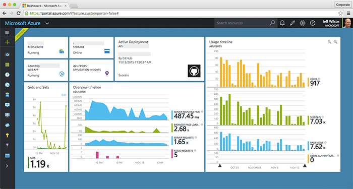
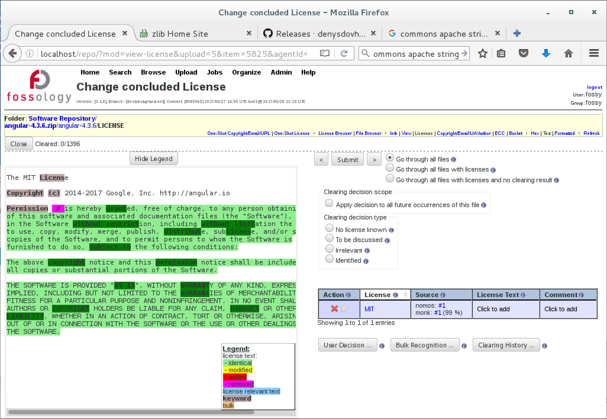
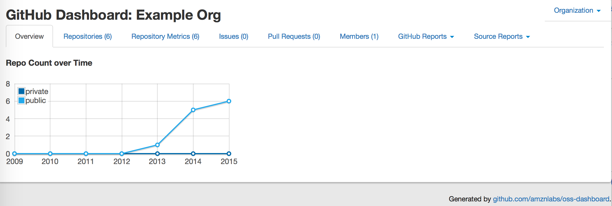
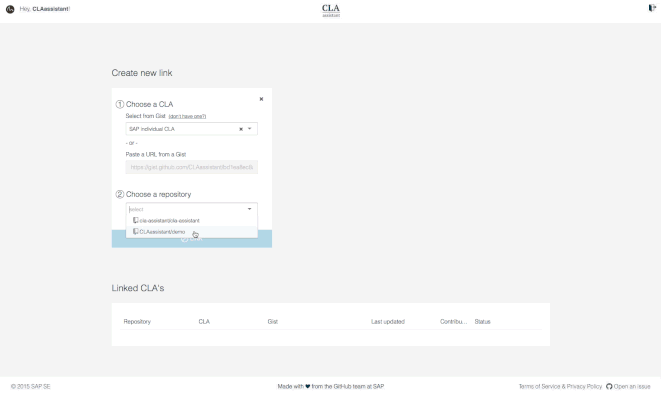

# Tools for Managing Open Source Programs

The road to strategic use of open source starts with a carefully planned, organized, and empowered open source program office to guide and manage its creation, distribution, and use. But that’s just a first step. To get such an office underway and running smoothly, you need the right tools. These mission-critical tools will be used to track goals and metrics in departments from engineering and legal to executive leadership, PR, and marketing, and give employees all the resources they need to gather data, provide snapshots of performance, and manage the daily use of open source within your company.

This guide provides details and scenarios for how to get your open source tool collection started, including information about the most important tools to use to track and manage your open source projects. Many of the tools have been created and open-sourced by The Linux Foundation and other leaders in the field, providing free and easy access for your projects. You’ll also find an example dashboard setup which combines and displays information from multiple tools.

**Table of Contents**

- [Why you need special tools for open source program management](#why-you-need-special-tools-for-open-source-program-management)
- [How to select and plan your tools](#how-to-select-and-plan-your-tools)
- [Elements of a basic toolset](#elements-of-a-basic-toolset)
- [Tools for managing source code](#tools-for-managing-source-code)
- [Tools for tracking project health](#tools-for-tracking-project-health)
- [Tools for communications and collaboration](#tools-for-communications-and-collaboration)
- [Tools for corporate-scale GitHub management](#tools-for-corporate-scale-github-management)
- [Final words](#final-words)

## Why you need special tools for open source program management

Once your open source program office is up and running, it’s time to collect the right software tools that will allow your development teams to manage, track, guide, and advance their open source projects, contributions, and releases.

These tools are critical because using open source for business strategy requires its own methodologies and processes which are very different than those needed when using and releasing proprietary software. Open source tools allow companies to do a myriad of tasks:

* Provide a workplace for collaboration and code building
* Manage project health
* Automate critical and repeatable tasks such as code review and tracking and license compliance
* Generate data to prove ROI for your program office and open source strategy, in general
* Oversee project quality and to make sure that guard rails are in place if issues arise.

Having the right targeted tools as you begin your open source path will also make jobs easier for developers and other employees, will provide better results, and will become the basis for successful collaboration and communications for a company’s open source projects.

> “If you have more than 100 code repositories or 100 people that you're trying to manage, you really can’t have someone doing it manually with spreadsheets anymore. Obviously, people still do it that way. But it starts to become ad hoc and laborious. That’s where tools come into play. They allow you to scale.” – [Jeff McAffer](https://twitter.com/jeffmcaffer), Director of the Open Source Programs Office at Microsoft

## How to select and plan your tools

Most of the early discussions about which open source tools are needed by a company will depend on its business, products, and services and how it serves its customers and employees. As the planning process and strategy map are developed by its open source program office, tools can be chosen to integrate the company’s goals, processes and infrastructure.

Ultimately, the only way to know which tools you will need is to understand what you want to do with open source.

Below are the basic steps for choosing the tools you’ll need for managing your open source program office:

1. Get buy-in and selection preferences from developers and community members. To accomplish this, you’ll want to conduct detailed discussions with developers and community members. They can describe what tools have been or would work best for them. Take those recommendations and requests very seriously. Listen to the people who are going to get you to your goal. They have most likely been using many of these tools already, so benefit from their experiences.
2. Understand necessary software dependencies and integrations for business-critical applications. This means understanding and knowing which open source software your business depends on so you can stay up to date with security issues and ensure software continuity.
3. Research existing tools and decide what you can use as-is, or build out to suit your needs. Don’t start from scratch for every tool. See what is out there and being used in the open source communities you are in and get advice and feedback about those tools. Linger in online development communities to see what works and ask for recommendations and advice. Ask questions at open source conferences, talk to fellow developers in Birds-of-a-Feather sessions, and learn from others who are already doing what you want to do.

Once selected, the tools must then be implemented, which requires several additional steps:

1. Create an internal infrastructure to support, manage, and use the tools. Through your newly-formed open source program office, designate someone to maintain and build the internal infrastructure that will distribute the tools through an online internal portal where they are kept and organized into tasks and features. In this tool portal you can make the tools available to all developers or restrict them to specific users through authentications and permissions based on their jobs and requirements.
2. Provide training plans for employees who will use the tools. Just getting the tools isn’t enough. Now you have to be sure that your developers know how to use them and are mastering their capabilities. This is where training programs, whether online, in classrooms or in small lunchtime group settings, will be important to reap the benefits of their use. Ask your developers which learning methods work best for them and let them choose how they want to learn.
3. Ensure the tools are centrally visible in your organization. Make it easy for developers to find and use them, preferably integrated into any existing developer dashboards that track development progress. Again, this is where the internal tool portal is going to help your company organize and distribute the critical tools for your operations.

Implementation is helpful to keep in mind as you are choosing your tools, as this may also affect your decision. A tool with a steep learning curve, for example, may require more training.

### Leverage existing tools

After you have a good idea of what your team needs to meet your organization’s open source goals and the possible limitations of your own dependencies and infrastructure, the first step is to explore and learn about existing tools that are ready-built and available for you today. Since most are open source tools themselves, if they don’t meet your exact needs at the start, your development teams can contact the builders of the tools to see if they can collaborate and contribute to take the tools in new directions by adding features.

Ironically, many open source program offices don’t always reuse the tools developed by others, or collaborate with other companies to work on the tools they require to manage their open source programs. Often, they want to do that, but many businesses, including Facebook and Microsoft, already have existing tool suites which were in place before collaboration really became a discussion topic. Because they already have their tool sets and have made those investments, they seem to have less desire to adopt those of other companies.

That’s where companies that are just starting to build out their own open source programs have a significant advantage. Since they are now establishing their own open source program offices and diving into open source, they don’t have to be bothered with such limitations.

Instead, they can wisely take advantage of the experiences and successes of others and build their open source toolboxes using the proven tools created by companies which led the way in recent years. The Linux Foundation’s open source industry organization, the [TODO Group](http://todogroup.org/) (Talk Openly Develop Openly), has been working on assembling a tool-filled “Open Source Program Office in A Box” starter package, which would give companies the ability to launch their open source efforts with a cohesive, pre-assembled kit of tools. The starter package isn’t yet ready, but the hope is that eventually it could make it easier for a company to deploy and configure the tools they need with less initial effort. Some of the members of the TODO Group working on this project include Adobe, Capital One, Comcast, Facebook, Google, eBay, IBM, Microsoft, Samsung, and Twitter.

### Create a dashboard

Along with the proper tools, companies should also incorporate central dashboards which allow them to monitor and track their open source projects and development in real time. Many companies likely have such dashboards for existing development work and applications and may be able to integrate the existing dashboards with their open source work. If not, they should create or adopt new dashboards to improve the management of their open source deployments.

> “On dashboards, there are many ways to create them, and it’s really an art in terms of how companies want to display development-related information. Some people build these fancy screens with rotating dashboards, but the key thing is to have a central location**, preferably co-located with your existing dev dashboards,** where people can go to learn more about open source project health, metrics, and so on.” – [Chris Aniszczyk](https://twitter.com/cra), COO of the Cloud Native Computing Foundation.

## Elements of a basic toolset

The abundance of tools available for managing and reporting on open source projects can quickly become overwhelming. If your open source program is just getting started, it helps to focus your research on just a few of the basic tools that you’ll need to get up and running.

Then as your program grows and you’ve gained more experience using these tools, you can start to adopt new tools to help you automate and streamline your processes as the need arises. Remember that you want the tools you choose to complement and support your internal culture and processes – not lead them.

The sections below give the basic categories of tools that pretty much all open source programs use on a daily basis. This is a good way to organize your research.

### Automate processes

Tools which automate processes are among the most important you will select and use for your company’s open source program. The tasks for such tools are broad, including automating procedures for contributor license agreements (CLAs), which are legal documents stating that a developer created the code and didn’t copy it from anywhere else illegally. Traditionally these kinds of agreements were done manually by printing out the agreements and then signing and faxing them in to comply. But in a world of email and instant communications, that’s crazy today. Instead, the process can be automated using bots that request electronic signatures and then track and handle the submissions.

Other automation tools can tell you who exactly is contributing to your projects and can help

remove procedural friction which slows down progress in projects as they get larger and scale to meet the needs of companies.

In Microsoft’s open source program office, where some 8,000 repositories are managed on GitHub involving some 11,000 contributors, about 40,000 internal requests came in to use open source in projects in 2016, according to the company. To manage those requests as well as the code that’s created and the code versions which are being updated,the company turns to tools which can automate the chaos. And because the code is likely being used in potentially hundreds of other projects, it must be tracked carefully so that if a security bug arises all software impacts can quickly be mapped out and fixed. At such a large scale, automation is critical and manual updates would be almost impossible.

### Manage critical tasks

Other important tools to be considered and acquired are those which help manage critical tasks, such as project management, tracking project health and ensuring clear and quick communications between developers, open source communities, and others inside a company.

### Source code management

Most corporate software projects being developed through open source program offices use [GitHub](https://GitHub.com/about) as their centralized hosting and development platform.

GitHub is an online source code management site that allows open source developers to manage and house their code in a central “repository” or storage space where participants can collaborate and build their code together. Some 64 million open source coding projects are hosted within GitHub today, involving some 23 million developers.

GitHub users can add code, review submitted code, propose changes, get and offer feedback and provide project management using the service. GitHub uses the [Git Version Control System](https://git-scm.com/), the open source project developed by Linux creator Linus Torvalds which provides organization for the code and people who are collaborating on open source. Each “contributor” has their own copy of the project repository they are working on, where they can make changes on their own computer and then submit it back to the project for future inclusion. That “pull request,” ([example here](https://GitHub.com/GitHub/opensource.guide/pull/402/files)) or code contribution, is then reviewed, discussed, modified and approved or rejected by the project organizers.

### License compliance

Also important are code scanning and compliance tools, which help track code provenance and license requirements. It’s important for companies to watch over the open source code being brought into its own infrastructure, products, and services to ensure license requirements are met.

Your applications, for example, could include several thousand open source components. To protect your company from legal issues it’s critical to know these details. In scenarios that are high risk, users must dive into the code to deeply validate and verify that the licenses are what they say they are, depending on where your business is on a risk spectrum. (See our guide on using and distributing open source code.)

> “You must understand your risk profile, because in the end scanning is all about risk management. You can stick your head in the sand at one end then just trust and hope that you are OK. Or you could say ‘If I get sued, it’s going to devastate my business.’ You need to really be sure. So, you crack open the package and you look through all the lines of code and you find everything that could possibly be in there.” – [Jeff McAffer](https://twitter.com/jeffmcaffer), director of the Open Source Programs Office at Microsoft.

## Tools for managing source code

As we discussed earlier GitHub is the go-to source code management system for most open source program offices these days. But GitHub alone won’t meet all your program’s code management needs – especially as you scale up your efforts.

Some of the tools used in the world of open source are aimed at improving GitHub itself by adding features it lacks, such as support for checking Developer Certificate of Origin (DCO) statements to be sure that code can be legally licensed and used in an open source project.

GitHub also has some deficiencies when it comes to code reviews, so there are available tools that can automatically send questionable code back to the contributors who created it and ask them to review and make needed changes. GitHub doesn’t have a way to force someone to review their code, so these clever tools make that happen to improve workflows.

Other GitHub-specific tools expand on GitHub’s performance metrics capabilities, which tend to be very project specific rather than providing detailed information across whole organizations. For companies that maintain many open source code repositories across multiple GitHub projects, better tools are needed to organize and aggregate them to make sense of it all. A wide range of such tools are available from Amazon, Netflix, and Microsoft to help with those tasks.

Here are some of the most popular and useful source code management tools which can streamline and help your GitHub presence:

**Source code scanning and license compliance**

[Antepedia Reporter](http://www.antepedia.com/pages/tools.html) – A commercial, fee-based application from Antepedia, Reporter is a report-generation product which lets developers, project managers, legal advisors and others create license compliance audits and IP rights management reports about the open source, public and private components in your code base.

[Black Duck Hub](https://www.blackducksoftware.com/products/hub) – The commercial Hub service scans code to identify all embedded open source components, and then automatically searches for known vulnerabilities for remediation. It can send alerts when new vulnerabilities are found in your code.

[Black Duck Protex](https://www.blackducksoftware.com/products/protex) – Protex is a commercial, fee-based license compliance management tool from Black Duck which integrates with existing tools to automatically scan, identify and inventory open source software, while also enforcing license compliance and corporate policy requirements.

[Copyright review tools](https://wiki.debian.org/CopyrightReviewTools) – This collection of command line tools help make initial copyright file construction and subsequent review and update easier.

[dep-checker](http://git.linuxfoundation.org/dep-checker.git/) – A dependency checker tool from The Linux Foundation, dep-checker performs a complete analysis of linkages between code packages.

[FlexNet Code Insight](https://www.flexerasoftware.com/enterprise/products/software-vulnerability-management/flexnet-code-insight/) – Flexera, which acquired licensing compliance vendor Palamida in 2016, offers FlexNet Code Insight to help automate corporate open source use among developers, legal teams and security staffers.

[FOSSA](http://fossa.io/) – This is a commercial tool that automatically performs code dependency tracking, license compliance scanning in the background.

[FOSSology](https://www.fossology.org/) – A Linux Foundation project, FOSSology is an open source license compliance software toolkit which can run license, copyright and export control scans from the command line. A database and web UI are also available to create compliance workflows.

[janitor.git](http://git.linuxfoundation.org/janitor.git/) – Code Janitor is an open source tool that helps evaluate source code for compliance with open source licenses. From The Linux Foundation, [Code Janitor](https://www.linuxfoundation.org/sites/default/files/lf_foss_compliance_cjt.pdf) can be used with other products to check code.

[LicenseFinder](https://github.com/pivotal/LicenseFinder) – Detects the licenses of the code being used in your projects, compares those licenses against a user-defined whitelist and then provides an actionable report.

[Protecode Enterprise Analyzer](http://www.protecode.com/our-products/system-4/enterprise-analyzer/) – This commercial application is used to analyze and identify all code in any directory to determine code ownership and ensure open source license compliance based on predetermined internal policies.

[scancode-toolkit](https://github.com/nexB/scancode-toolkit) – From nexB, the ScanCode suite of utilities scans code for licenses, copyright and dependencies to find, discover and inventory open source and third-party components used in your code.

[SPDX](https://spdx.org/tools) – The Software Package Data Exchange (SPDX) specification is a standard format used to describe the components, licenses and copyrights associated with software packages. The SPDX standard aids compliance with free and open source software licenses by standardizing the way license information is shared between developers and companies. The SPDX specification is developed by the SPDX workgroup, which is hosted by The Linux Foundation. The group offers open source [tools](https://spdx.org/tools) to help users of SPDX documents.

[WhiteSource](https://www.whitesourcesoftware.com/) – Provides licensing, security, code quality and reporting analysis for managing open source components in real-time by automatically and continuously scanning dozens of open source repositories.

### Bug and issue tracking

[Bugzilla](https://www.bugzilla.org/) – Server-based software featuring an advanced query tool that can remember searches, integrated email capabilities and a comprehensive permissions system. Bugzilla is used by [Mozilla](https://bugzilla.mozilla.org/) as its bug tracking system.

[GitHub Issues](https://help.github.com/articles/about-issues/) – GitHub’s own integrated feedback and bug tracker, GitHub Issues is available as part of GitHub’s project hosting.

[GitLab](https://about.gitlab.com/) – This bug tracking tool unifies issue tracking, code review, Git repository management,

activity streams, wikis and more in a single UI to assist your open source projects.

[JIRA](https://www.atlassian.com/software/jira) – From Atlassian, JIRA contains custom filters, developer tool integrations, customizable workflows and rich APIs to integrate JIRA with other applications.

### Archiving and release management

[Artifactory](https://www.jfrog.com/artifactory/) – Also from JFrog, Artifactory is a repository manager which supports software packages created in any code language. It integrates with all major DevOps and continuous integration and continuous deployment tools.

[Bintray](https://bintray.com/) – An archiving tool from JFrog that allows companies to publish their code release archives to maintain storage for older and larger files.

[Docker Hub](https://hub.docker.com/) – A cloud-based registry service which allows users to link to code repositories and build and test their images. It also stores manually-pushed images and links to [Docker Cloud](https://docs.docker.com/docker-cloud/) so users can deploy images to project hosts. Docker Hub is a centralized resource for container image discovery, distribution and change management, collaboration and workflow automation throughout the development pipeline.

[github-release](https://github.com/aktau/github-release) – The built in functionality part of GitHub which lets users [package and edit releases](https://help.github.com/articles/about-releases/) of projects on GitHub so they are available for use by other community members.

## Tools for tracking project health

Monitoring and tracking the overall health of open source projects as they grow and mature is a core task for an enterprise open source program. To accomplish it, you must gather tools which report on how individual open source projects are performing and being received by their communities – often across dozens, hundreds or even thousands of projects at once. The tools also must be able to roll the data into meaningful, useful, and actionable information about overall project performance across your entire open source portfolio.

The bottom line here is it’s all about the critical and useful insights you can glean from the data – not about vanity metrics such as detailing how many “watcher” stars a project has logged, how many contributors have been part of the project since its start, or other metrics that lack important context.

The best project health tools must also help the project teams be responsive to the communities which support their efforts and encourage engagement and diversity with contributing developers. That means the tools help maintainers quickly respond to questions or feedback posted by community members so they remain enthusiastically engaged and don’t get bored and move on to other projects.

Some open source communities will have large groups of contributors, while others will have small niche groups of community members. The project health tools need to be able to work with projects of all sizes.

> “Regarding existing tools and systems, my hope is that we're quickly getting to a point where a company’s open source program office should not need to create any tools or technologies on their own. They should be able to find and use existing open source tools which can be used to manage their open source programs.” – [Jeff McAffer](https://twitter.com/jeffmcaffer), Director of the Open Source Programs Office at Microsoft

Here are some of the most popular and useful project statistics and project health tracking tools:

* [CatWatch](https://github.com/zalando-incubator/catwatch) – CatWatch is an open source metrics dashboard from Zalando that fetches GitHub statistics for your GitHub accounts, processes and saves your GitHub data in a database. The data reveals the popularity of your open source projects, your most active contributors and other interesting statistics.
* [Gander](https://github.com/paypal/Gander) – Gander is a dashboard which generates usable metrics for a range of open source projects in one quick look. Created by PayPal, Gander is designed for individuals who are responsible for running Open Source Program Offices or keeping track of multiple open source projects.
* [GHCrawler](https://github.com/Microsoft/ghcrawler) – Created by Microsoft, GHCrawler is a GitHub API crawler that crawls a GitHub-hosted project and automatically tracks, retrieves, and stores its contents. GHCrawler is primarily intended for people trying to track sets of organizations and data repositories.
* [Gittagstats](https://github.com/mcharleb/gittagstats) – Gittagstats is a tool which generates statistics reports from a set of tags for a Git repository. The tool was created by Qualcomm.
* [GrimoireLab](https://grimoirelab.github.io) – GrimoireLab has a variety of open source tools to measure open source project statistics and visualize them, from git repositories, GitHub pull requests or Bugzilla tickets to mailing lists, Meetup groups or Slack channels. GrimoireLab is a project in [CHAOSS](https://chaoss.community), a collaborative group on open source development metrics.
* [OSS-dashboard](https://github.com/amzn/oss-dashboard) – The Open Source Program Dashboard, which comes from Amazon, is a multi-function dashboard which can be used to view and monitor many GitHub organizations and or users at one time.
* [OSS Tracker](https://github.com/Netflix/osstracker) – OSS Tracker, from Netflix, collects data about a GitHub organization and aggregates it across all projects within that organization in a single user interface. All repositories are listed and metrics are combined for an organization, but community managers can also organize projects into functional areas and appoint administrators to assign management and engineering leads.

> “The goal is to have the tools, along with transparent data and metrics-related information, which can be used to guide the organization.” – [Chris Aniszczyk](https://twitter.com/cra), COO of the Cloud Native Computing Foundation

The TODO Group also offers a [helpful list that adds other tools](https://GitHub.com/todogroup/awesome-oss-mgmt) as well:

### For better code reviews:

* [mention-bot](https://github.com/facebook/mention-bot) – Developed by Facebook, this tool automatically mentions potential reviewers for code contributions by community members to speed up the review process.
* [PullApprove](https://about.pullapprove.com/) – Brings more formalization to code contributions – or pull requests – by improving code quality through peer-review, enforcing style guidelines, catching errors and providing security checks on code.
* [sentinel](https://github.com/habitat-sh/sentinel) – A repository management bot which reviews and tests code contributions, builds a list of maintainers for the repository and communicates the status of a pull request with users.

### For Contributor License Agreements

[CLA Assistant](https://github.com/cla-assistant/cla-assistant) – Contributed by SAP, the CLA Assistant streamlines workflows by handling the legal side of contributions for users. The Assistant asks code contributors to sign CLAs as they make their code contributions and authenticates each contributor with his or her GitHub account. It also updates the status of a pull request when the contributor agrees to the CLA and automatically asks users to re-sign the CLA for each new pull request if changes are made to the CLA.

[CLA Portal](https://github.com/vmware/claportal) – From VMware, CLA Portal adds a workflow to enable contributors to digitally sign a CLA for pull requests to your GitHub repositories. When a developer opens a pull request, they are prompted to sign the agreement if needed. Also included is an administrator interface for CLA authoring, CLA-to-project mapping, and agreement reviews.

[DCOB](https://github.com/chef/dcob) – A Developer Certificate of Origin Bot which helps to enforce developer certificate of origin sign-offs for each code change in a pull request. The DCOB sets the status for each accepted code change, as required by the [Developer Certificate of Origin](http://developercertificate.org/).

### GitHub Management at Corporate Scale

* [hubcommander](https://github.com/Netflix/hubcommander) - A Slack bot for GitHub organization management, HubCommander uses chat-ops – or conversation-driven development – to help manage GitHub projects. It creates a simple way to perform privileged GitHub organization management tasks without granting administrative or owner privileges to your GitHub organization members.
* [opensource-portal](https://github.com/Microsoft/opensource-portal) – From Microsoft, this tool is designed to help large organizations with their large-scale GitHub management operations, onboarding and more. This is one of a suite of tools provided by the Open Source Programs Office at Microsoft.
* [settings](https://github.com/bkeepers/github-configurer) – This app syncs repository settings defined in .github/settings.yml to GitHub, enabling pull requests for repositories.
* [zappr](https://github.com/zalando/zappr) - Zappr is a GitHub integration built to enhance project workflows. From Zalando, zappr helps developers to increase productivity and improve open-source project quality by removing bottlenecks around pull request approval and helping project owners halt “rogue” pull requests before they're merged into the project master branches.

### Project Quality

* [CII Best Practices Badging](https://bestpractices.coreinfrastructure.org/) – From The Linux Foundation, the Core Infrastructure Initiative (CII) Best Practices badge is a way for Free/Libre and Open Source Software (FLOSS) projects to show that they follow best practices. Projects can voluntarily self-certify for free by using this web application to explain how they follow each best practice.
* [CodeClimate](https://codeclimate.com/) – Code Climate empowers organizations to take control of their code quality by incorporating fully configurable test coverage and maintainability data throughout the development workflow. It’s free for open source projects!

## Tools for communications and collaboration

Of course, open source development isn’t just about the code. It also requires healthy communications and collaborations between a diverse group of people who are working on the projects inside and outside of enterprises,as well as by staff members in a company’s Open Source Program Office.

For that developers can lean on tools they may already be using for other projects, including [Internet Relay Chat (IRC)](http://www.irc.org/links.html), where developers can post inquiries and get [quick responses to development-related topics](http://blog.andrewray.me/irc-the-secret-weapon-of-developers/). Another example is [TWiki,](http://twiki.org/) which is an open source enterprise Wiki and web collaboration platform where developers can discuss code and projects and related topics.

Communications can also be fostered through social media platforms, web portals, open source project repositories and other places where input, questions and discussions can be found and fostered.

Other useful tools include [mention-bot](https://github.com/facebook/mention-bot) from Facebook, which can help get fast input turnaround on pull requests by automatically mentioning potential reviewers for reviews. This is especially appreciated when GitHub projects get too big for community members to subscribe to all of a project’s notifications.

Then there’s [Slack](https://slack.com/), which is an online team project management and communications platform where users can access and share messages and files, organize workflows, perform searches for information and more. Slack can be configured to receive notifications for support requests, code check-ins, error logs and other tasks as well.

And don’t forget your company’s public relations and marketing staff when it comes to shouting out your company’s participation and support of open source. Social media accounts with sites including Twitter, Reddit, Facebook, LinkedIn, Google+ and others are important, as well as the use of internal and external blogs and websites. Customer Relationship Management (CRM) software, as well as email blasts and newsletters, can help companies keep customers and clients informed about their open source progress.

## Tools for corporate-scale GitHub management

When it comes to the tools your company provides and uses for its corporate open source projects, the most important ones are arguably those which help companies manage their corporate-scale GitHub operations. GitHub is a perfect platform for many operations, but for large, complex companies such as Google, Microsoft, Facebook, Twitter, LinkedIn and others, there can be many limitations to using the standard GitHub offerings.

Large enterprises need many more capabilities, including things like identity management, settings and permissions management, security and two-factor authentication enforcement, as well as deeper means to understand and track code repositories.

That’s where specialized, automated tools often need to be built to handle tasks such as onboarding, offboarding, enforcing security policies and giving developers request access to repositories.

Microsoft responded to its own unique requirements by building its own tools to handle many such tasks to streamline and improve its open source program. Microsoft has a [healthy presence on GitHub,](https://github.com/Microsoft) with some 1,345 repositories and involving about 3,580 developers to date.

> “That management of your GitHub presence is something that as you scale, it becomes important. You get a GitHub organization, which is a collection of repositories, and then you get members and you have teams. Managing all of that stuff becomes a little bit complicated, especially if it starts to scale out to hundreds of repositories, hundreds of people and multiple organizations on GitHub.” – [Jeff McAffer](https://twitter.com/jeffmcaffer), Director of the Open Source Programs Office at Microsoft

One of the things Microsoft created was a custom-built self-service [GitHub management and onboarding portal](http://www.jeff.wilcox.name/2015/11/azure-on-github/) for organizing its projects, repositories, and teams. On its simplest level, the web-based portal allows developers to map their Microsoft company ID to their GitHub ID, which bolsters system security and helps simplify the organization of large numbers of developers who are involved in large numbers of important projects.

The portal also lets employees authenticate with GitHub and Microsoft, which creates a “virtual link” of their identities so they can do their work while giving them needed permissions for tasks depending on their work roles. If employees leave the company, the system can be adjusted to remove or reclassify their access rights as needed.

The portal runs on one or more cloud servers and relies on a cache to help with sessions and reduce pressure on the GitHub API. The Microsoft portal, which averages about 1,000 unique users daily as a tool for its engineers, is part of the company’s growing open source efforts, which now includes more than 10,000 engineers who are using, contributing to and releasing open source code.

## Final words

Hey, nobody said it was going to be simple to move your company into the world of open source. But plenty of other companies, including giants like Microsoft and Google have done this before you and have provided detailed road maps, code, suggestions, and more to make your own journey easier.

The creation of an open source program office and the selection of a package of critical tools to get your efforts started are within your grasp. And they are likely already inspiring great anticipation among your developers, many of whom are probably already contributing to open source projects on their own (or at work, under cover of darkness).

By collaborating on open source projects and inviting others to collaborate with you, your company can gain immeasurable benefits and drive its progress forward with energy and innovation.

Having the right tools is critical to empowering your company’s open innovation.

## Acknowledgements

Contributors:
* [Chris Aniszczyk](https://twitter.com/cra), COO of the Cloud Native Computing Foundation.
* [Jeff McAffer](https://twitter.com/jeffmcaffer), Director of the Open Source Programs Office at Microsoft.

*These resources were created in partnership with the TODO (Talk Openly, Develop Openly) Group – the professional open source program networking group at The Linux Foundation. A special thanks goes out to the open source program managers who contributed their time and knowledge to making these comprehensive guides. Participating companies include Autodesk, Comcast, Dropbox, Facebook, Google, Intel, Microsoft, Netflix, Oath (Yahoo + AOL), Red Hat, Salesforce, Samsung and VMware. To learn more, visit: [todogroup.org](http://todogroup.org/)*
